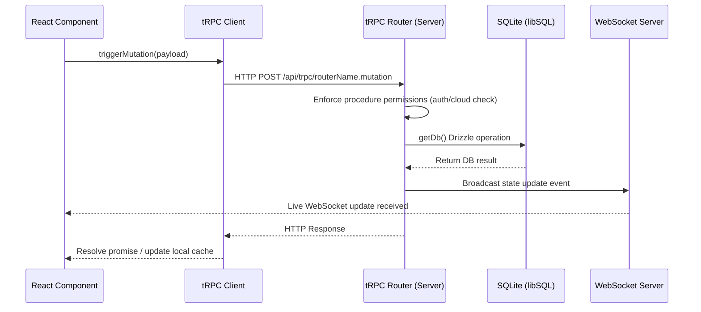
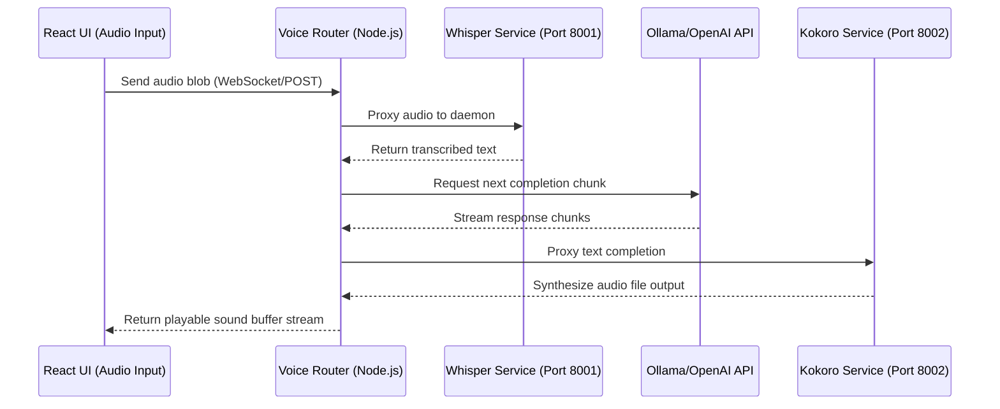

# Omnecor — System Architecture

This document defines the technical foundation, directory structure, system boundaries, data flow pipelines, database schemas, and the absolute rules governing the Omnecor codebase.

---

## 🛠️ 1. Technical Stack & Foundation

Omnecor is structured as a monolithic local-first application designed for rapid deployment, air-gapped security, and distributed local execution:

*   **Frontend Client:** React 19 Single Page Application (SPA), written in TypeScript. 
    *   *Routing:* [wouter](https://github.com/molecula/wouter) for lightweight routing.
    *   *Styling:* CSS-first configuration using Tailwind CSS v4+ with custom HSL/OKLCH color system variables defined in [Globals.css](file:///home/linux/Documents/OmnecorV1-Beta/client/src/Globals.css).
    *   *State Management:* [Zustand](https://github.com/pmndrs/zustand) for shared global store properties (WS state, sidebar layout, themes).
    *   *Data Fetching:* tRPC client + TanStack Query (React Query) for end-to-end typed queries and mutations.
*   **Backend Server:** Node.js (Express + tRPC), bootstrapping on a single HTTP port.
    *   *Endpoints:* tRPC API endpoints exposed under `/api/trpc`.
    *   *Real-time Sync:* WS server `/ws` mounted on the main HTTP server via a shared connection upgrade.
    *   *Services:* Managed singleton service classes (ProcessManager, MemoryService, HashTrackerService, security scans).
*   **Database layer:** SQLite via [libSQL](https://github.com/tursodatabase/libsql) (Drizzle ORM).
    *   *Dialect:* SQLite core features.
    *   *Local Mode (Default):* Embedded SQLite file stored at `~/.omnecor/data/omnecor.db`.
    *   *Networked Mode:* Optional configuration mapping to Turso / remote libSQL URL.
*   **Optional Python Microservices:** Standalone daemons performing CPU/GPU-heavy workloads (Whisper, TTS/Kokoro, RVC, ComfyUI, head-less Blender). The Node server proxies requests and degrades interfaces gracefully if services are unreachable.

---

## 📁 2. Folder Structure Directory

Below is the directory map of the active codebase:

```bash
/home/linux/Documents/OmnecorV1-Beta/
├── client/                     # React 19 Frontend SPA
│   ├── public/                 # Static public web assets
│   └── src/                    # React Source code
│       ├── _core/              # Core layout containers, routers, providers
│       ├── components/         # UI component primitives & complex widgets
│       ├── contexts/           # Theme, NeuralMap and visual configurations
│       ├── hooks/              # Custom React helper hooks
│       ├── lib/                # Zustand stores and tRPC client init
│       ├── pages/              # 15 dashboard page view bundles
│       ├── types/              # Client-side typescript definitions
│       ├── App.tsx             # Main routing switch & providers wrapper
│       ├── Globals.css         # Styling system & OKLCH variables
│       └── main.tsx            # DOM mount entry point
├── server/                     # Express & tRPC Backend Server
│   ├── _core/                  # Bootstrapping middleware, express config
│   ├── ommesh/                 # mDNS discovery and LAN synchronization
│   ├── python_bridges/         # Service integration bridges (Python scripts)
│   ├── routers/                # Sub-routers for tRPC procedures
│   ├── phase2/                 # Legacy routers (agent, AI provider)
│   ├── db.ts                   # libSQL database connection instantiation
│   ├── db.factory.ts           # Canonical DB export factory
│   ├── routers.ts              # Unified Master Router composition
│   └── storage.ts              # Local session & upload management
├── shared/                     # Shared models, constants & interfaces
├── drizzle/                    # Drizzle migrations schema mapping
│   ├── migrations/             # Auto-generated SQL migrations
│   └── schema.ts               # Core database tables definition (sqlite-core)
├── models/                     # Local model weights directory (GGUF, EXL2)
└── packaging/                  # Electron application packaging config
```

---

## 🧱 3. System Boundaries & Execution Modes

Omnecor operates under strict security boundaries configured via the user's `executionMode` attribute:

```
┌────────────────────────────────────────────────────────┐
│                   Omnecor Sandbox                      │
│                                                        │
│  ┌──────────────┐      tRPC      ┌──────────────────┐  │
│  │   Frontend   ├───────────────>│   Express/tRPC   │  │
│  │ (React SPA)  │<───────────────┤   Node Server    │  │
│  └──────────────┘   WebSockets   └────────┬─────────┘  │
│                                           │            │
│                                  Local    │            │
│                                  Bridges  │            │
│                                           v            │
│  ┌──────────────┐               ┌──────────────────┐  │
│  │  Local DB    │               │  Python Services │  │
│  │ (libSQL file)│               │  (Port 8000-8188)│  │
│  └──────────────┘               └──────────────────┘  │
└───────────────────────────────────────────┬────────────┘
                                            │
                                  Network   │ (ExecutionMode Dependent)
                                  Boundary  v
                               ┌──────────────────┐
                               │ Cloud API Models │
                               │ (OpenAI/Gemini)  │
                               └──────────────────┘
```

1.  **Local Isolation:** By default, all operations run inside the local environment. No external connections are requested unless cloud providers are configured.
2.  **Execution Modes:**
    *   `sovereign`: Absolute air-gapped isolation. Any attempt to query cloud APIs via `cloudProcedure` procedures throws a `FORBIDDEN` error.
    *   `scrapper`: Default mode. External cloud requests are permitted and tracked by the token budget manager.
    *   `big_spender`: Higher budget thresholds for resource-intensive cloud workloads.
3.  **Network Compute (OMMESH):** Discovery is limited to the local Area Network (LAN) using multicast DNS (mDNS) over a shared `OMMESH_SECRET`. Nodes cannot expose endpoints to the WAN directly without external VPN routing.

---

## 🔄 4. System Data Flow Pipelines

### 4.1 UI Database Mutation Flow


### 4.2 Audio Synthesis & Generation Flow


---

## 🗄️ 5. Database Schema Entities

The database uses Drizzle ORM configured for **libSQL / SQLite** in [schema.ts](file:///home/linux/Documents/OmnecorV1-Beta/drizzle/schema.ts). The major schemas include:

### Core Users & Sessions
*   `users`: Tracks authorization profiles, role levels (`viewer`, `user`, `admin`, `owner`), and the active `executionMode`.
*   `integrations`: Houses encrypted external credentials, tokens, and access keys.
*   `chat_sessions` & `chat_messages`: Manage conversation hierarchies and message roles (`system`, `user`, `assistant`, `tool`, `function`).

### Spend Telemetry & Budget Controls
*   `project_budgets`: Strict limits on cents spend, alert thresholds, and enforcement modes (`soft` vs `hard` caps).
*   `spend_log`: Immutable logger tracking every token consumed and estimated microcent spend.

### System Processes & Flows
*   `pipelines` & `pipeline_phases`: Tracks the progress of multi-agent tasks through the GodMode workflow loop (`DEFINE` -> `PLAN` -> `EXECUTE` -> `REVIEW` -> `SHIP`).
*   `cloud_compute_sessions` & `cloud_compute_subscriptions`: Track server instances rented dynamically via RunPod or Vast.ai.

### Hardware & Specialized Modules
*   `design_projects`, `design_saves` & `component_library_items`: Backings for the KiCad and PCB schema creation dashboards.
*   `neural_maps`: Persistent configurations for user brain maps and folder context overrides.
*   `personas`: System records storing configurations for customized AI assistants.

---

## 🚫 6. Hard Rules (AI Core Directives)

To prevent regression, circular dependency loops, and architectural violations, the following rules are **strictly enforced**:

1.  **DB Isolation Rule:** React components, hooks, and pages must *never* import from Drizzle, import `drizzle/schema.ts`, or call `getDb()`. All data must be fetched and modified via tRPC router procedures.
2.  **UI Logic Separation:** Backend code, routers, services, and Python bridges must *never* import React, window UI modules, or rely on frontend styling. They must remain headless data processors.
3.  **Strict Path Aliasing:** Never write relative imports navigating outside sub-projects. You must leverage Vite configuration aliases:
    *   Use `@/` for imports relative to `client/src/`
    *   Use `@shared/` for imports relative to `shared/`
    *   Use `@assets/` for imports relative to `attached_assets/`
4.  **Sovereignty Mode Enforcement:** Any router procedure making external network cloud requests (e.g., Anthropic, Fal, OpenAI calls) **must** use `cloudProcedure` rather than `protectedProcedure`. This automatically triggers sandbox blocks when the user's execution mode is set to `sovereign`.
5.  **Service Singleton Rule:** Subsystems (e.g., `MemoryService`, `HashTrackerService`, `ProcessManager`) must remain Singletons instantiated inside `server/_core/` and accessed via the `TrpcContext` context object (`ctx.services.*`). Do not instantiate multiple instances in routers.
6.  **No Hardcoded Paths:** Do not write hardcoded absolute paths inside logic routines. Utilize configured environment parameters or relative mapping config files.
7.  **No Silent Mutations:** Any database insertion, update, or deletion that modifies application state must return the updated object or broadcast a message via the WebSocket Pub/Sub network to prevent client UI sync desynchronization.
