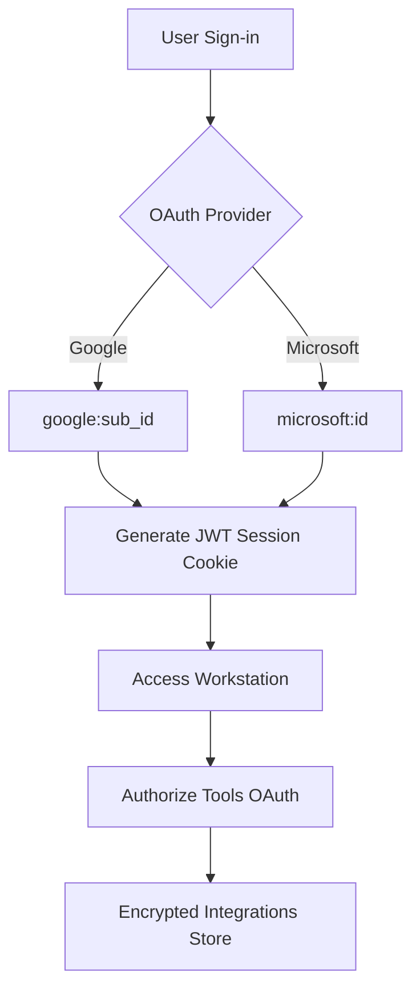

# Omnecor — Master Project Overview

Omnecor is a sovereign, context-aware, local-first AI Workstation designed to unify fragmented software engineering, media synthesis, and hardware prototyping workflows. By consolidating multi-agent orchestration, local LLM fine-tuning, voice pipelines, and hardware CAD/rendering bridges, Omnecor functions as a secure, local-first "central nervous system."

---

## 🎯 1. Product Vision & Value Proposition

### What is Omnecor?
Omnecor is an offline-resilient, multi-user technical workstation designed for home networks (LAN) or private cloud virtual machine (VM) rentals. It integrates deterministic multi-agent graphs with hardware design, local machine learning, audio-visual asset generation, and physical testing.

### Who is it for?
*   **AI & ML Engineers:** Requiring low-latency local execution, custom fine-tuning via LoRA/QLoRA, and real-time visualization of attention weights.
*   **Full-Stack Prototypers:** Needing boilerplate code generators and automated agent loops to draft, scan, and deploy microservices.
*   **Creative Technologists:** Utilizing node-based pipelines (ComfyUI) for visual assets, character voice cloning (XTTS-v2), and headless 3D mesh rendering (Blender).

---

## ⚠️ 2. Problem Statement

AI engineering and content creation are heavily fragmented across disjointed, cloud-dependent platforms:
1.  **Context Fragmentation:** Intent and file references are lost when moving between tools (e.g., jumping from VS Code to ComfyUI, n8n, and CrewAI).
2.  **Hardware Ceiling:** Local inference requires substantial VRAM, blocking developers from running larger parameter models (70B+) locally.
3.  **Privacy & Credit-Burn Risks:** Organizations face data leakage risks when exposing proprietary codebases to cloud APIs, alongside opaque billing structures.

**Omnecor solves this** by establishing a local-first application framework that discover peers on local networks to pool resources (**OMMESH**), encrypts secrets at rest, and manages context across tiered memory models.

---

## 👥 3. Target Personas & Scenarios

### 💻 Persona 1: Alex (AI Engineer)
*   *Motivation:* Deep control over agent execution pathing, local resource utilization.
*   *Scenario:* Alex builds a LangGraph workflow to process directory structures. He routes model queries to a secondary machine on his local network via **OMMESH** to run a quantized Llama-3 70B model.

### 🎨 Persona 2: Casey (Creative Director)
*   *Motivation:* Stylistic consistency, high-fidelity synthesis, automated rendering.
*   *Scenario:* Casey builds a ComfyUI pipeline to generate character textures, renders them headlessly via the Blender bridge, and generates dialogue scripts using XTTS-v2 cloned voices in the Podcast Studio.

### ⚡ Persona 3: Pat (Full-Stack Prototyper)
*   *Motivation:* Maximum speed from a single prompt to a functional codebase.
*   *Scenario:* Pat triggers an automated agent template. Background workers write schema tables, generate React hooks, run security validations, and notify the team channel on completion.

---

## 🌐 4. Authentication, User Management & Network Topology

Omnecor prioritizes **context sovereignty** and is explicitly designed as a single-tenant or team-hosted system, rather than a public multi-tenant SaaS application.

### 4.1 Deployment Topologies
*   **Single-Node Sovereign:** A single user running locally (via Electron or web server) with an embedded SQLite database at `~/.omnecor/data/omnecor.db`. Functions entirely offline.
*   **Private Network LAN (OMMESH Cluster):** Multiple machines on a local subnet discovering each other via mDNS. Compute and memory are shared securely following manual authorization using signed tokens.
*   **Private Cloud VM (Team Instance):** Hosted on a private virtual machine (AWS EC2, Hetzner, etc.) behind a secure VPN. Supports multiple team members accessing shared files and a central libSQL database.

### 4.2 User Management & OAuth 2.0 Flow
Omnecor supports federated OAuth 2.0 for user sign-in and external service authorization.



1.  **User Identity Syncing:** For multi-user VM or LAN setups, users authenticate using Google or Microsoft Graph API. The system verifies logins and maps credentials to `openId` records in the database (`google:<id>` or `microsoft:<id>`).
2.  **PKCE Enforcement:** Proof Key for Code Exchange (RFC 7636) secures the authorization code flow, utilizing database-backed state trackers with a 10-minute TTL.
3.  **httpOnly Session Cookies:** Session tokens are transmitted via secure `httpOnly`, `sameSite: "strict"` cookies to protect against XSS and CSRF. Native desktop and mobile clients utilize equivalent `Authorization: Bearer <token>` headers.
4.  **AES-256-GCM Encryption at Rest:** Credentials, personal access tokens (PATs), and API keys are encrypted using AES-256-GCM using keys derived from the instance's unique `JWT_SECRET` before being committed to disk at `~/.omnecor/integrations.json`.
5.  **Token Refresh Pipelines:** Handlers pre-emptively renew expiring OAuth credentials or reactively intercept HTTP `401 Unauthorized` responses to refresh tokens dynamically.

### 4.3 External Integration Scopes
Omnecor requests narrow scopes to coordinate external workflows:
*   *GitHub:* `repo`, `read:org`, `user` (to commit code, manage pull requests, and list repositories).
*   *Google Workspace / Gmail:* `gmail.readonly`, `gmail.send`, `drive.file` (to trigger flows on email receipts, send summaries, and read/write spreadsheets).
*   *Microsoft Graph:* `Mail.Read`, `Mail.Send`, `Files.Read.All` (for Outlook triggers and OneDrive file synchronization).
*   *Slack:* `channels:read`, `chat:write` (to post notifications and log summaries to channels).
*   *Notion:* Workspace access tokens (to read/write database tables).

---

## 🗺️ 5. Comprehensive Web & Desktop Interface Reference

The desktop layout is composed of a shell styled in [Globals.css](file:///home/linux/Documents/OmnecorV1-Beta/client/src/Globals.css) with fifteen (15) routes managed in [App.tsx](file:///home/linux/Documents/OmnecorV1-Beta/client/src/App.tsx):

### 5.1 SetupWizard (`/setup`)
*   *Description:* 8-step onboarding assistant configuring workstation attributes.
*   *Visuals:* Centered glassmorphic wizard card overlaying dynamic canvas backgrounds.
*   *Interactive Elements:*
    *   *Mode Selectors:* Toggle inputs setting `executionMode` to `sovereign`, `scrapper`, or `big_spender`.
    *   *Ollama URL:* Input field for local LLM port mapping (default: `http://localhost:11434`).
    *   *API Key Fields:* Password-masked inputs for OpenAI, Anthropic, Gemini, and Groq.
    *   *mDNS Discovery Switch:* Toggle switch enabling LAN peer search.
    *   *Knowledge Base Path:* Text input and folder picker establishing the local document indexing path.
    *   *Resource Limits:* Sliders allocating maximum VRAM (in GB) and maximum indexable file size (in MB).
    *   *Scan Hardware Button:* Triggers hardware scans via `trpc.system.detectHardware`.

### 5.2 Dashboard (`/`)
*   *Description:* Central monitor displaying hardware load metrics and workflow states.
*   *Visuals:* Responsive grid showing system resource rings and quick-action navigation cards.
*   *Interactive Elements:*
    *   *Navigation Cards:* Scale-on-hover shortcuts routing to Chat, BrainMap, ModelHub, Wallet, and Integrations.
    *   *Hardware Pollers:* Automated query hooks charting memory, CPU, and GPU load parameters in real-time.

### 5.3 Chat Workspace (`/chat`)
*   *Description:* Stream-rendering conversational view supporting multi-agent commands and file indexing.
*   *Visuals:* Three-pane window: Sidebar (sessions), Center (chat flow), Right (active context elements).
*   *Interactive Elements:*
    *   *Prompt Input:* Textarea supporting Shift+Enter, `/` commands autocomplete, and `@` file references.
    *   *Attachments Bin:* Triggers OS file uploads via `attachmentsRouter`.
    *   *Voice Input Button:* Hold-to-record microphone triggers transcribing to `trpc.voice.transcribe`.
    *   *Stop Generation Button:* Interrupts active token stream subscription.
    *   *Memory Archiver Button:* Calls `trpc.ai.summarizeAndPruneSession` to compact contexts.
    *   *Terminal Toggle:* Slide-up drawer displaying active `xterm.js` CLI instances.

### 5.4 BrainMap (`/brain-map`)
*   *Description:* Infinite-canvas node visualizer charting code structures, folder hierarchies, and file states.
*   *Visuals:* ReactFlow canvas with floating control overlays and sidebar metadata inspectors.
*   *Interactive Elements:*
    *   *Layout Selector:* Swaps layout algorithms (Force-Directed, Hierarchical, Mind-Map, Circular).
    *   *Sliders & Toggles:* Adjusts node sizes (20px to 50px), physics iteration speeds, and GPU acceleration.
    *   *Auto-Clustering Switch:* Groups related sub-directories into unified nodes.
    *   *Add to Context:* Right-click node menu option to append file references directly to the active chat context.
    *   *External Link Toggle:* Opens canvas in a detached multi-window browser instance.

### 5.5 External Brain Map (`/brain-map-external`)
*   *Description:* Isolated canvas view for multi-display setups.
*   *Visuals:* Full-viewport ReactFlow board.
*   *Interactive Elements:*
    *   *Redock Button:* Closes external tab and returns focus to the parent dashboard.

### 5.6 ModelHub (`/model-hub`)
*   *Description:* Registry manager for local models and cloud API setups.
*   *Visuals:* Split card layouts. Left: Model search and pull queue. Right: Detail parameter charts.
*   *Interactive Elements:*
    *   *Pull Model:* Input and button sending names to `trpc.ollama.pullModel`.
    *   *Quantization Selector:* Dropdown choosing GGUF or EXL2 target formats.
    *   *Use Model Button:* Sets model in chat store and redirects immediately to `/chat`.
    *   *Delete Model Button:* Safely purges model weights from local directories.

### 5.7 Pipelines (`/pipelines`)
*   *Description:* Graph-based execution dashboard for n8n tasks and LangGraph scripts.
*   *Visuals:* Horizontal flow timelines detailing active phase nodes.
*   *Interactive Elements:*
    *   *New Pipeline Button:* Forms capturing goals and scripting scopes.
    *   *Phase Approvals:* Compact buttons to approve checkpoints or abort running tasks.

### 5.8 3DDesigner (`/3d-designer` & `/3d-designer-external`)
*   *Description:* Viewport supporting 3D rendering, schematic CAD routing, and code editing.
*   *Visuals:* Left tree file view, middle Three.js webGL canvas / schematic editor, right properties tab.
*   *Interactive Elements:*
    *   *Mode Tabs:* Toggles viewport between 3D Model, PCB Schematic, Web Sandbox Preview, and Code Editor.
    *   *Open in Blender:* Button triggering headless Python subprocess renders via the Blender bridge.
    *   *Open in KiCad:* Button launching local KiCad PCB layouts via the KiCad bridge.
    *   *Mesh Raycaster:* Click selection of meshes (cube, sphere, cylinder) to trigger AI edit prompts.

### 5.9 Integrations Manager (`/integrations`)
*   *Description:* Connections portal for tools, OAuth, and MCP servers.
*   *Visuals:* Category sheets detailing connected vs available services.
*   *Interactive Elements:*
    *   *OAuth Triggers:* Buttons navigating to authentication urls.
    *   *Disconnect Button:* Removes tokens and keys from storage configurations.
    *   *Add MCP Server:* Form capturing server command paths, IDs, and transport protocols.

### 5.10 AgentNetworking (`/agent-networking`)
*   *Description:* Social media schedule manager, autopilot controller, and curation hub.
*   *Visuals:* Grid cards representing discovery queues, calendars, and OMMESH node trust queues.
*   *Interactive Elements:*
    *   *Curator Decisions:* Buttons to curate drafts, schedule posts, or regenerate copies.
    *   *Auto-Pilot Switch:* Toggles background scheduling intervals.
    *   *OMMESH Trust Actions:* Button to approve detected LAN node keys.

### 5.11 PodcastStudio (`/podcast-studio`)
*   *Description:* Dialog pipeline writer, voice cloning selector, and wave exporter.
*   *Visuals:* Left source markdown index, middle script timeline rows, right waveform playback board.
*   *Interactive Elements:*
    *   *Timeline Row Add/Delete:* Timeline row editors adjusting dialogue flows.
    *   *Speaker & Emotion Dropdowns:* Configures target voice models and synthesis states (happy, neutral, concerned).
    *   *Generate Podcast Button:* Triggers the backend stitching pipeline.
    *   *Playback Bar:* Buttons to play, pause, download WAV buffers, or export JSON scripts.

### 5.12 AgenticWallet (`/wallet`)
*   *Description:* Spend limits controller and virtual cards issuer.
*   *Visuals:* High-contrast credit dashboard detailing limit curves.
*   *Interactive Elements:*
    *   *Scope Toggle:* Toggles charts between Global limits and Project UUID constraints.
    *   *Unmask Card Details:* Toggle icon displaying card strings on the UI dashboard card.
    *   *Issue Virtual Card:* Trigger input passing limit caps to Lithic integrations.

### 5.13 Notifications Console (`/notifications`)
*   *Description:* System log manager and agent messenger panel.
*   *Visuals:* Split logs catalog next to active message dialogue feeds.
*   *Interactive Elements:*
    *   *Clear Logs:* Button purging alert database rows.
    *   *Agent Input Box:* Chat text area sending message payloads to specific active agent IDs.

### 5.14 System Settings (`/settings`)
*   *Description:* Global configuration panel.
*   *Visuals:* Multi-tab panel grids categorized by General, Privacy, Advanced, Knowledge, and OMMESH.
*   *Interactive Elements:*
    *   *Settings Search Input:* Text field filtering target tabs.
    *   *Toggles & Sliders:* Adjusts temperatures, session intervals, auto-save settings, and portable modes.
    *   *Ingest Directory Button:* Trigger initiating file parsing pipelines on selected paths.

---

## 📱 6. Comprehensive Mobile APK Interface Reference

The companion Android APK utilizes a portrait-locked view model optimized for touch:

```
┌──────────────────────────────────────┐
│ [Tab Header] Selector Toggles        │
├──────────────────────────────────────┤
│                                      │
│                                      │
│           Active Viewport            │
│            (Chat / WebGL)            │
│                                      │
│                                      │
├──────────────────────────────────────┤
│ [Footer Navigation]                  │
│ [Chat]   [3D View]   [Pod]   [Config]│
└──────────────────────────────────────┘
```

### 6.1 Chat Tab (`index.tsx`)
*   *Description:* Single-column messaging hub synced to the desktop database.
*   *Interactive Elements:*
    *   *Session Picker:* Dropdown selecting active thread IDs.
    *   *Brain Map Scope Selector:* Picker choosing context scopes.
    *   *Audio Recorder:* Hold-to-record button encoding sound clips.

### 6.2 3D Viewer Tab (`viewer.tsx`)
*   *Description:* Touch-control CAD view rendering layouts via an OpenGL/WebGL WebView container.
*   *Interactive Elements:*
    *   *Viewport Pills:* Swaps display targets between 3D model, Schematic map, or Code editor tabs.
    *   *Gesture Handler:* Single drag to rotate, pinch to zoom, and double drag to pan camera coordinates.
    *   *Mesh Highlighter:* Highlights clicked vertices with orange mesh indicators.

### 6.3 Podcast Tab (`podcast.tsx`)
*   *Description:* Audio generation preview screen.
*   *Interactive Elements:*
    *   *Voice Model Selectors:* Dropdowns configuring speaker outputs.
    *   *Timeline Grippers:* Touch handles supporting script reordering.
    *   *Podcast Synthesis Trigger:* Large button triggering synthesis tasks on the desktop host.
    *   *Playback Bar:* Wires play/pause controls to the local audio player.

### 6.4 Settings Tab (`settings.tsx`)
*   *Description:* Desktop connectivity manager and system preferences controller.
*   *Interactive Elements:*
    *   *SSH Config Inputs:* Text fields for host IP, port, user account, and SSH keys.
    *   *Ping Button:* Visual test verification pinging desktop daemon ports.
    *   *Dark Mode Toggle:* Switch linked to `useThemeContext()` to update stylesheet themes.

---

## 🛠️ 7. Core Backend Architectural Pillars

1.  **Deterministic Agent Orchestration (LangGraph):** Graph-based engine coordinating agent states. Enforces human-in-the-loop validation halts and uses `HashTrackerService` to prevent runaway agent loops.
2.  **OMMESH (LAN-Native AI Cloud):** Zero-configuration peer discovery using mDNS. Enables token-level model inference split across multiple nodes on a local network, avoiding GPU bottleneck barriers.
3.  **Local-First Custom LLM Training:** Employs Unsloth / LoRA wrappers to fine-tune standard open weights models (Mistral, Gemma) on localized directories, preserving 100% data sovereignty.
4.  **Hardware & Headless Media Bridges:** Python bridges interfacing with:
    *   *Blender:* head-less rendering, mesh generation, asset packing.
    *   *KiCad:* ERC/DRC verification and Bill-of-Materials compilation.
    *   *ESPTool:* Serial IoT device detection and firmware flashing.
5.  **Multi-tier Memory Architecture:**
    *   *Working Memory:* Persisted MySQL active chat contexts.
    *   *Long-Term Memory:* Semantic vector store powered by ChromaDB.
    *   *Episodic Memory:* Summarized interaction logs stored for semantic context query indexing.

---

## 📊 8. Scope Matrix & Success Criteria

### ✅ In Scope
*   **mDNS Local Node Discovery:** Automatic scanning and verification of LAN peers for OMMESH configuration.
*   **Local Quantized Inferencing & Training:** Fine-tuning via Unsloth and execution routing using local GPU/CPU.
*   **Node-Based Visual Flows:** Integration with ComfyUI APIs and custom deterministic graph visualizers.
*   **Rule Enforcement (`.omnecorrules`):** Pre-execution agent prompt verification that blocks non-compliant or destructive file operations.
*   **Spend Limits Safeguards:** Real-time token cost evaluation with automatic termination triggers on the service loop.
*   **Multi-User LAN/VM Hosting:** Supporting private, single-tenant team deployments on home subnets or cloud VPS VM nodes.
*   **External Service Integration:** Encrypted storage of OAuth integration access tokens for emails (Gmail/Outlook), repositories (GitHub), and documentation (Notion/OneDrive).

### ❌ Out of Scope
*   **Universal Cloud hosting / Multi-tenant SaaS:** Omnecor is strictly local-first and peer-to-peer (LAN) focused.
*   **Native Video Hosting Platforms:** Large media assets must write directly to local storage or external endpoints; no streaming platform is hosted.
*   **Low-Level GPU Driver Development:** Reliance on system-provided CUDA/ROCm runtimes.
*   **General project ticketing:** The app is a technical workstation; it does not replace Jira or general productivity suites.
*   **Global WAN Discovery Tunnels:** Connecting remote nodes outside the local LAN must be managed via standard user VPNs; automatic global discovery is excluded.

---

## 📚 9. Master Feature Plan & Capability Map

> Authoritative inventory of all features, capabilities, and architectural goals (merged from the former `master-feature-plan.md`). **Vision:** Omnecor v3.0.0 — The Autonomous AI Workstation.

### 9.1 Core AI & Chat Engine
*   **Multi-Provider Hub:** Ollama, OpenAI, Anthropic, Google Gemini, Groq, Fal.ai, Hugging Face, and Llama.cpp.
*   **Valet Router (1.5B → V2):** Fine-tuned Qwen-based router for task-to-model mapping. V1 outputs committed; V2 dataset + pipeline scripts complete. V2 deployed as `omnecor-valet-router:v2-q8` (Ollama backend); rule-based fallback remains until artifact confirmed loaded. Route accuracy 0.7385 (independent Kaggle P100 eval, beats keyword baseline ~2.7×; below the 0.85 config gate).
*   **Hierarchical Context Management:** Rolling terminal buffers, permanent Goal & Plan buffers, auto-summarization (Chat.tsx auto-compresses after 50 messages: keeps last 6 + system summary).
*   **Action Hash Loop Detector:** HITL-gated protection against AI infinite loops (`ai.reportLoopViolation`).
*   **Streamdown Rendering:** Real-time Markdown + interactive component rendering in chat.
*   **Context Transparency:** Visual indicators of active files, token usage, latency/cost.
*   **Memory Systems:** Session vs. persistent episodic memory (Drizzle/libSQL + ChromaDB); Honcho AI memory layer.
*   **Prompt Sanitization:** Adversarial injection defense + NFC normalization (`PromptSanitizer`).

### 9.2 OMMESH Distributed Intelligence
*   **mDNS Discovery:** Automatic LAN node detection and federation.
*   **mTLS Security:** Encrypted node-to-node communication; shared `OMMESH_SECRET`.
*   **VRAM-Weighted Routing:** Load balancing across mesh nodes by hardware availability.
*   **Topology Map:** Visual mesh network representation (react-force-graph).
*   **Mesh Compute UI:** Panel for monitoring and authorizing peer nodes (`ommesh.approvePeer`).

### 9.3 Creative & Manufacturing Suite (3D Designer)
*   **3D Viewer:** React Three Fiber canvas for GLTF/OBJ/Primitive rendering.
*   **Schematic/PCB Editor:** React Flow diagramming with dark-circuit aesthetic.
*   **Web Preview:** Sandboxed iframe for live AI-generated UI testing + WYSIWYG Visual Editor (style inspector, element dragging, inline text edit).
*   **Workspace Code Editor:** Tab-based virtual file system, scroll-synced line numbers, Markdown preview; Visual Diff Checker (Accept/Reject/Suggest).
*   **Neural Brain Map:** `fileTreeToNetwork.ts` file-to-graph rendering; multi-source maps (local dirs, `github://owner/repo`, `integration://provider`); `buildMasterNetwork()` workspace-level aggregate (polar layout); Visual Controller (Force/Hierarchical/Mind-Map/Circular layouts, Node Size, Animation Speed, GPU Acceleration, Auto-Clustering — Zustand+localStorage persist); drag-to-context (`⋮⋮` grip); inline label editing (`labelOverrides` in DB); `neuralMaps` table + `neuralMapsRouter`; User & Project Peer Cards injected into AI system prompt; Fiction Mode.
*   **Manufacturing Pipelines:** Blender Bridge (headless render, glTF export, script exec); KiCad Bridge (DRC/ERC, STEP/Gerber export, BOM); PCBWay integration (quoting + ordering, HITL-gated).

### 9.4 Agent Networking & Social Automation
*   **Omnichannel Publishing:** X/Twitter, LinkedIn, Instagram, TikTok, Facebook, YouTube.
*   **AI Curator Hub:** RSS/API discovery feed (`ArticleDiscoveryService`), AI summarization, draft curation (`generatePostDraft`).
*   **Content Scheduler:** Calendar view; `schedulingRouter.publishNow` + auto-publish worker (`publishWorker.ts`).
*   **Engagement Analytics:** Reach, impressions, sentiment tracking.
*   **Persona Studio:** Bio/tone/posting-schedule management (`personas` table + `personaRouter`).

### 9.5 Security & Sovereignty
*   **Zero-Login Mode:** Air-gapped operation with synthetic local admin.
*   **Execution Modes:** Sovereign / Scrapper / Big Spender.
*   **Immutable Audit Log:** Append-only event tracking + PII scrubbing; retention scheduler (`AuditLogService` — default 14 days, 28/permanent options, 6-hour purge).
*   **File Security:** AES-256-GCM encryption + YARA vulnerability scanning.
*   **RBAC Matrix:** Viewer / User / Admin / Owner roles with granular permissioning.
*   **HITL Gates:** Human approval for dangerous actions (file deletion, card issuance, MCP `dangerous:true` tools, crews > 3 agents).

### 9.6 Infrastructure & Systems
*   **Agentic Wallet:** Budget enforcement, model pricing estimation, Lithic Virtual Credit Cards (`VirtualCardService`, AES-256-GCM PAN encryption).
*   **Voice Pipeline:** Faster-Whisper (STT), XTTS-v2 / Kokoro (TTS), RVC (Voice Conversion); ElevenLabs provider.
*   **Specialized Module Launchers:** ESPTool (firmware flashing, Windows COM auto-detect), LLM Builder (Unsloth fine-tuning + Kaggle GPU training), Cloud Compute Rental (Vast.ai, RunPod, Lambda Labs).
*   **Cross-Platform Packaging:** Linux (deb, AppImage, Flatpak), Windows (NSIS, Portable), Android (Expo/React Native APK — see Build-Plan appendices).
*   **System Health Dashboard:** GPU detection, VRAM monitoring, auto-update (`UpdateCheckerService`).
*   **Unified Notifications & Agent Messenger:** In-memory ring buffer + WS (`NotificationService`, `AgentMessengerStore`), on desktop + APK.

### 9.7 "Dark Logic" (backend implemented, UI exposure varies)
*   **Mesh Federation Approval** — `ommesh.approvePeer` ✅ (`SecurityManager.ts`); namespace fixed `mesh`→`ommesh`.
*   **Hardware Control** — `espRouter.flash` ✅ full ESPTool bridge + UI.
*   **Social Ingestion** — `discoveryRouter` + `curatorRouter` ✅; Discovery tab in AgentNetworking.
*   **Financial Insights** — `walletRouter.getSpendLog` ✅; `BudgetPanel` renders spend history.
*   **Memory Archiving** — `aiRouter.summarizeAndPruneSession` ✅ procedure (auto-trigger via 50-message compression).
*   **Batch Dataset Processing** — `trainingRouter.validateDataset` ✅; exposed via `UnslothPanel`.

### 9.8 Build Status & Deferred Items
*   **Valet Router** advisory→deployed (`omnecor-valet-router:v2-q8`); final `pnpm valet:build` sign-off pending a clean GPU box.
*   **Android APK** — fully wired (PC handlers + 8 mobile screens); debug APK built (100 MB); physical-device + on-device-inference testing remain (see Build-Plan APK appendices).
*   **Net input-tracker state** (Session 12/13): ~850+ elements, ~337 CONNECTED, ~491 LOCAL, ~0 DEAD, ~0 PARTIAL. Full detail in [UI-Registry.md](./UI-Registry.md).
