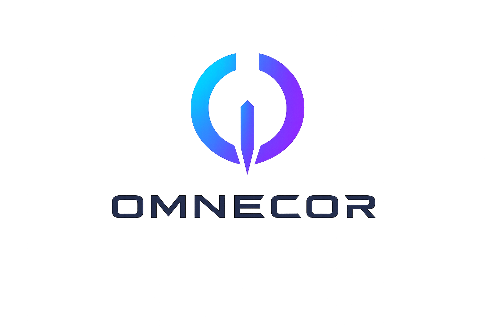

**The Sovereign AI Workstation. Where imagination becomes infrastructure.**

---

Omnecor is a powerful, elegant, and polished local-first AI workstation designed for power users who demand both function and beauty. It seamlessly integrates local and API-based AI models, manages complex projects, and orchestrates multi-step workflows—all in one refined interface.

---

---

## Features

Omnecor is engineered as a modular, production-grade workstation. Every feature below is implemented and available in the current release.

### Core Infrastructure
- **Unified Backend** — Centralized Express.js/tRPC engine with real-time UI/data state synchronization via WebSockets.
- **End-to-End Type Safety** — tRPC + Drizzle ORM + Zod across the full stack. No runtime type surprises.
- **MySQL/TiDB Persistence** — Chat history, session state, budgets, audit logs, and pipeline records stored in a relational DB.
- **Real-Time WebSocket Layer** — Live event streaming for AI responses, training progress, hardware jobs, budget alerts, and mesh topology.

### AI & Model Hub
- **Multi-Provider AI Routing** — Connect OpenAI, Anthropic, Google Gemini, Ollama, Llama.cpp, and Fal.ai from a single interface.
- **Execution Modes** — Three user-selectable modes enforced at the server middleware layer:
  - 🔴 **Sovereign** — 100% local. All cloud calls blocked by `sovereignCheck` middleware.
  - ⚡ **Scrapper** *(default)* — Local-first with cloud fallback. Maximum efficiency.
  - 🔥 **Big Spender** — Cloud-first for maximum quality on production runs.
- **Valet Router** — Fine-tuned local 1.5B classifier that routes prompts to the optimal provider without a cloud call.
- **Local LLM Support** — First-class Ollama and Llama.cpp integration with VRAM-aware model selection.

### Agentic Workforce
- **Multi-Agent Orchestration** — Autonomous agents collaborate on software, media, and hardware tasks using shared context.
- **Human-in-the-Loop (HITL)** — Critical agent actions require explicit human approval before execution.
- **GodMode Pipelines** — 5-phase gated execution (DEFINE → PLAN → EXECUTE → REVIEW → SHIP) with per-phase approval gates.
- **Agent Memory (RAG)** — ChromaDB vector store + `MemoryArchitectService` for semantic, long-horizon context retrieval.
- **Agent Audit Trail** — Every agent spawn, termination, and tool call is written to the immutable audit log.

### Neural Brain Map
- **Spatial Graph Workspaces** — React Flow canvas for visualizing projects, files, and knowledge as interactive node graphs.
- **Semantic Indexing** — Import any folder; Omnecor chunks, embeds, and indexes it into ChromaDB automatically.
- **Drag-and-Drop Construction** — Build knowledge graphs, pipeline flows, and project structures visually.

### Hardware Integration
- **Blender Bridge** — Headless Python subprocess bridge for 3D modeling, rendering, and scene automation.
- **KiCad Bridge** — PCB design automation and 3D viewer (`PCBViewer3D.tsx`) powered by React Three Fiber.
- **ESPTool Bridge** — Flash ESP32/ESP8266 firmware, auto-detect serial ports, monitor flash progress in real-time.
- **ComfyUI Integration** — Node-based media generation pipeline with async prompt queueing.

### Voice Pipeline
- **Speech-to-Text (STT)** — Faster-Whisper powered microservice with real-time transcription.
- **Text-to-Speech (TTS)** — XTTS-v2 synthesis with optional ElevenLabs cloud enhancement.
- **Voice Cloning (RVC)** — Real-time voice conversion for generating speech in any cloned voice.

### OMMESH Distributed Intelligence
- **LAN Mesh Discovery** — mDNS/Bonjour auto-discovery of other Omnecor nodes on the local network.
- **Secure Federation** — mTLS mutual authentication between all mesh nodes.
- **VRAM-Weighted Routing** — Inference requests delegated to the mesh node with the most available VRAM.
- **Real-Time Topology** — `mesh:node_joined` / `mesh:node_left` WebSocket events keep the UI in sync.

### Agentic Wallet & Budgeting
- **Per-Project Budgets** — Set hard or soft spend limits (in cents) per project.
- **Real-Time Spend Tracking** — `budget:spend` WebSocket events update spend meters after every cloud API call.
- **Auto-Downgrade** — When a hard limit is hit, remaining tasks are automatically re-routed to local Ollama models.
- **Virtual Credit Cards** — Lithic API integration issues unique virtual cards per project for total financial isolation.
- **Manual Tracking Mode** — Full spend logging without `LITHIC_API_KEY`; no card required.

### Security & Sovereignty
- **Immutable Audit Log** — Append-only `audit_log` table captures all privileged events. No delete/update API exists.
- **PII Redaction** — `redactSensitiveData()` scrubs API keys and personal data before any log entry is written.
- **Prompt Injection Defense** — `PromptSanitizer` blocks injection attempts and fires `security:injection_attempt` events.
- **Zero-Login / Air-Gapped Mode** — `ZERO_LOGIN_MODE=true` bypasses OAuth entirely; auto-enforces Sovereign Mode.
- **Extended OAuth** — Manus, Google, and Microsoft identity providers supported out of the box.
- **Role-Based Access Control** — Four roles: `viewer`, `user`, `admin`, `owner`.

### Developer Experience
- **Command Palette** — `Ctrl+K` global search and action launcher.
- **Fine-Tuning UI** — Unsloth/LoRA training pipeline with live loss/accuracy charts.
- **Valet Dataset Builder** — One-click JSONL training data generation from real audit + spend log history.
- **YARA Security Scanning** — Integrated malware/threat pattern scanning for uploaded files.
- **Accessibility** — WCAG 2.1 AA compliance tested with axe-core across all pages.
- **Packaging** — AppImage, `.deb`, Flatpak, and systemd service targets included.

---

## Architecture Overview

Omnecor operates as a unified application with a single Express server serving as the entry point. It integrates a tRPC API for efficient communication, a WebSocket server for real-time updates, and handles static file serving for the frontend. Key architectural components include:

- **tRPC API**: All API endpoints are accessible at `/api/trpc/`.
- **WebSocket Server**: Attached at `/ws` on the same HTTP server, facilitating real-time Neural Node-Tree and training progress updates.
- **OMMESH**: The distributed mesh intelligence layer for multi-node discovery and inference routing.
- **Phase 2 Services**: Singletons like `SecurityService`, `VectorDBService`, and `ProcessManagerService` are initialized at startup to ensure readiness.

---

## Installation

For detailed installation instructions, including system requirements and platform-specific guides, please refer to the [INSTALL.md](INSTALL.md) file.

---

## Quick Start

To get Omnecor up and running quickly, follow the steps outlined in the [QUICKSTART.md](QUICKSTART.md) guide.

---

## Configuration

Omnecor's configuration is managed through environment variables (e.g., `.env` file) and granular UI settings. For comprehensive details on available configuration options and their impact, consult the [Configuration Guide](docs/user-guides/USER_GUIDE.md#8-configuration-guide).

---

## Project Structure

The repository is organized into several key directories:

- `client/`: Contains the frontend application built with React and Vite.
- `server/`: Houses the backend services, tRPC routers, and AI integration bridges.
- `docs/`: Stores detailed documentation, including architecture, API, and user guides.
- `packaging/`: Contains scripts and configurations for application packaging (AppImage, Deb, Flatpak).
- `drizzle/`: Database schema and migration files.
- `shared/`: Shared types and utilities between client and server.

---

## Development

Information on contributing to Omnecor, including coding standards, pull request processes, and testing expectations, can be found in the [CONTRIBUTING.md](CONTRIBUTING.md) file.

---

## Roadmap

For upcoming features, planned enhancements, and the overall direction of the Omnecor project, please refer to the [ROADMAP.md](ROADMAP.md) file.

---

## Documentation

Explore the comprehensive documentation suite in the [docs/](docs/) directory for in-depth information on various aspects of Omnecor.

---

## Acknowledgments

Omnecor stands on the shoulders of giants. See the full [Open Source Acknowledgements](docs/Acknowledgments/Open-Source-Acknowledgements.md) for the complete list of libraries, frameworks, and projects that made this workstation possible.

---

## License

Omnecor is released under the [MIT License](LICENSE).

---

**Operational Memory Never Escapes Context Overview Remains**
---
