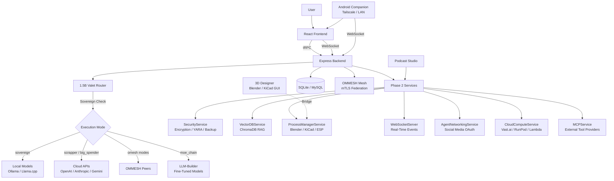

**The Sovereign AI Workstation. Where imagination becomes infrastructure.**

---

Omnecor is a powerful, Local-first AI workstation designed for power users who demand both function and freedom. It seamlessly integrates local and API-based AI models, manages complex projects, and orchestrates multi-step workflows—all in one refined interface.

---

---

**check out the live demo at.** [https://clarkescustomcreations.github.io/OmnecorV1-Beta/]

---

## Features

Omnecor is engineered as a modular, production-grade workstation. Every feature below is implemented and available in the current release.

### Core Infrastructure
- **Unified Backend** — Centralized Express.js/tRPC engine with real-time UI/data state synchronization via WebSockets.
- **End-to-End Type Safety** — tRPC + Drizzle ORM + Zod across the full stack. No runtime type surprises.
- **Flexible Persistence** — Support for **SQLite** (zero-infra default) and **MySQL/TiDB** (multi-user / production). Chat history, session state, budgets, and logs are stored reliably.
- **Real-Time WebSocket Layer** — Live event streaming for AI responses, training progress, hardware jobs, budget alerts, and mesh topology.

### AI & Model Hub
- **Multi-Provider AI Routing** — Connect OpenAI, Anthropic, Google Gemini, Ollama, Llama.cpp, and Fal.ai from a single interface.
- **Execution Modes** — Three user-selectable modes enforced at the server middleware layer:
  - 🔴 **Sovereign** — 100% local. All cloud calls blocked by `sovereignCheck` middleware.
  - ⚡ **Scrapper** *(default)* — Local-first with cloud fallback. Maximum efficiency.
  - 🔥 **Big Spender** — Cloud-first for maximum quality on production runs.
- **Valet Router** — Qwen2.5-1.5B-Instruct fine-tuned routing classifier (GGUF, served via llama-cpp-python). Produced by `pnpm valet:build`; distributed as a pre-built artifact via GitHub Releases. Auto-starts with the app when the artifact is present; falls back to keyword rules otherwise. No cloud call is ever made for the routing decision.
- **Local LLM Support** — First-class Ollama and Llama.cpp integration with VRAM-aware model selection.

### Agentic Workforce
- **Multi-Agent Orchestration** — Autonomous agents collaborate on software, media, and hardware tasks using shared context.
- **Human-in-the-Loop (HITL)** — Critical agent actions require explicit human approval before execution.
- **GodMode Pipelines** — 5-phase gated execution (DEFINE → PLAN → EXECUTE → REVIEW → SHIP) with per-phase approval gates.
- **Agent Memory (RAG)** — ChromaDB vector store + `MemoryArchitectService` for semantic, long-horizon context retrieval.
- **Agent Audit Trail** — Every agent spawn, termination, and tool call is written to the immutable audit log.

### Neural Brain Map
- **Spatial Graph Workspaces** — React Flow canvas for visualizing projects, files, and knowledge as interactive node graphs.
- **Semantic Indexing** — Import any folder; Omnecor chunks, embeds, and indexes it into ChromaDB automatically.
- **Drag-and-Drop Construction** — Build knowledge graphs, pipeline flows, and project structures visually.

### Hardware Integration
- **Blender Bridge** — Headless Python subprocess bridge for 3D modeling, rendering, and scene automation.
- **KiCad Bridge** — PCB design automation and 3D viewer (`PCBViewer3D.tsx`) powered by React Three Fiber.
- **ESPTool Bridge** — Flash ESP32/ESP8266 firmware, auto-detect serial ports, monitor flash progress in real-time.
- **ComfyUI Integration** — Node-based media generation pipeline with async prompt queueing.

### Voice Pipeline
- **Speech-to-Text (STT)** — Faster-Whisper powered microservice with real-time transcription.
- **Text-to-Speech (TTS)** — XTTS-v2 synthesis with optional ElevenLabs cloud enhancement.
- **Voice Cloning (RVC)** — Real-time voice conversion for generating speech in any cloned voice.

### Persistent Memory Layer
- **Cross-Session Memory** — External memory service that remembers durable facts about the user across sessions and projects.
- **Background Notes** — Use `/btw <note>` command to save persistent notes that are auto-injected into the chat system prompt.
- **Optional Honcho Configuration** — Enabled via `HONCHO_API_KEY` environment variable; gracefully disabled if not set (nothing breaks).

### Conversation Context Management
- **Token Budget Bar** — Visual indicator under chat input showing context usage (amber at ~70%, red at ~90% of model window).
- **Compress Command** — Use `/compress` to summarize conversation history and reclaim tokens; Goal & Plan buffer is never pruned.
- **Per-Message Exclusion** — Toggle individual messages out of context sent to the model without deleting them.

### OMMESH Distributed Intelligence
- **LAN Mesh Discovery** — mDNS/Bonjour auto-discovery of other Omnecor nodes on the local network.
- **Secure Federation** — mTLS mutual authentication between all mesh nodes.
- **VRAM-Weighted Routing** — Inference requests delegated to the mesh node with the most available VRAM.
- **Real-Time Topology** — `mesh:node_joined` / `mesh:node_left` WebSocket events keep the UI in sync.
- **Peer Indicators** — Sidebar footer shows discovered peers with hostname, latency, and available model counts; updates every 10 seconds.

### Agentic Wallet & Budgeting
- **Per-Project Budgets** — Set hard or soft spend limits (in cents) per project.
- **Real-Time Spend Tracking** — `budget:spend` WebSocket events update spend meters after every cloud API call.
- **Auto-Downgrade** — When a hard limit is hit, remaining tasks are automatically re-routed to local Ollama models.
- **Virtual Credit Cards** — Lithic API integration issues unique virtual cards per project for total financial isolation.
- **Manual Tracking Mode** — Full spend logging without `LITHIC_API_KEY`; no card required.

### Notifications & Agent Messenger
- **Unified Alert Feed** — One Notifications hub (sidebar, between Agentic Wallet and Settings) that aggregates everything you'd wait on: new chat replies, task/job completion, HITL approvals, and agentic-wallet budget alerts. Live unread badge over the `notifications` WebSocket channel.
- **Agent Messenger** — WhatsApp/Discord-style threads with your agents/personas, separate from project chats. Message always-on agents to plan, assist, start/check Omnecor tasks, or retrieve neural-map data; replies come from each persona's configured model backend.
- **Cross-Surface** — Available identically in the desktop GUI and the Android companion app (Alerts tab).

### Security & Sovereignty
- **Immutable Audit Log** — Append-only `audit_log` table captures all privileged events. No delete/update API exists.
- **PII Redaction** — `redactSensitiveData()` scrubs API keys and personal data before any log entry is written.
- **Prompt Injection Defense** — `PromptSanitizer` blocks injection attempts and fires `security:injection_attempt` events.
- **Zero-Login / Air-Gapped Mode** — `ZERO_LOGIN_MODE=true` bypasses OAuth entirely; auto-enforces Sovereign Mode.
- **Extended OAuth** — Google and Microsoft identity providers supported out of the box. Zero-login / air-gapped mode available for classified environments.
- **External API Hardening** — All cloud API calls (OpenAI, Lithic, cloud compute, etc.) protected by circuit breakers, exponential backoff, token refresh safety, and atomic transactions. Payment card data never exposed in errors or logs.
- **Role-Based Access Control** — Four roles: `viewer`, `user`, `admin`, `owner`.

### Developer Experience
- **Command Palette** — `Ctrl+K` global search and action launcher.
- **Chat Slash Commands** — `/compress` (token compression), `/btw <note>` (Honcho-backed persistent context notes), `/skill` (save workflow as reusable skill), `/plan` (Valet-guided project planning), plus `/clear`, `/new`, `/system`, `/export`, `/help`. Autocomplete popup on `/`.
- **Fine-Tuning UI** — Unsloth/LoRA training pipeline with live loss/accuracy charts.
- **Valet Dataset Builder** — One-click JSONL training data generation from real audit + spend log history.
- **YARA Security Scanning** — Integrated malware/threat pattern scanning for uploaded files.
- **Accessibility** — WCAG 2.1 AA compliance tested with axe-core across all pages.
- **Packaging** — AppImage, `.deb`, Flatpak, and systemd service targets included.
- **Real-Time File Watching** — `FileSystemWatcherService` monitors project directories and auto-updates the Neural Brain Map on changes.
- **Artifact Versioning** — Register, version, and compare training artifacts (models, datasets, checkpoints) within training workflows.
- **Image Generation Hub** — Unified interface for ComfyUI, Fal.ai, OpenArt, and Replicate with batch support and version history.

### Agent Networking & Social Media Automation
- **Multi-Platform Publishing** — Schedule and publish content across Twitter/X, LinkedIn, Instagram, TikTok, Facebook, and YouTube from one interface.
- **OAuth 2.0 Platform Connection** — One-click connection to all 6 platforms via OAuth; tokens stored securely with auto-refresh.
- **Content Discovery Engine** — AI-curated content from RSS feeds, keyword searches, and trending topics.
- **Character Persona Studio** — Create branded social identities with custom bios, tone, hashtags, and posting schedules.
- **Approval Workflows** — Review and approve AI-generated content drafts before publishing.
- **Engagement Analytics** — Real-time dashboard for reach, impressions, and engagement metrics per platform.
- **CSRF-Protected OAuth Flow** — State token validation (10-minute TTL) prevents authorization code injection.

### Cloud Compute & GPU Scaling
- **On-Demand GPU Rental** — Provision instances from Vast.ai, RunPod, and Lambda Labs without leaving Omnecor.
- **Cost Estimation** — Preview instance cost before provisioning; spend is tracked in the Agentic Wallet.
- **Session Lifecycle** — Provision, monitor, SSH into, and terminate cloud instances from the Settings panel.
- **Persona Agent Backends** — Assign rented compute as the inference backend for always-on Persona agents.

### MCP Tool Integration
- **External Tool Providers** — Connect any MCP-compatible server as a tool provider for agents.
- **Auto-Discovery** — Tool schemas are discovered automatically from connected MCP servers.
- **Cached Schemas** — Tool schemas are cached locally to reduce latency on repeated calls.
- **Multi-Server Support** — Connect and manage multiple MCP servers simultaneously.

- **File Encryption** — AES-256-GCM per-file encryption with per-file key derivation; metadata stored in database.
- **System Backup & Recovery** — Full and incremental backups with restore-and-rollback capability; configurable retention policies.
- **Vulnerability Scanning & IoC Detection** — YARA-based file scanning against threat intelligence feeds before file processing.
- **Loop Detection** — Circular dependency and runaway agent spawn detection with configurable admin override.

### 3D Designer & Live Preview
- **Multi-Mode 3D Workspace** — Standalone `/3d-designer` page with four integrated modes: 3D Viewer (React Three Fiber, GLTF/OBJ/primitives with mesh selection + AI query bridge), PCB/Schematic Editor (React Flow with dark-circuit-board aesthetic), Web Preview (sandboxed iframe for AI-generated UI testing), Code Editor (tab-based virtual file system with Markdown preview and visual diff checker).
- **Floating Windows & External Monitors** — Detach any mode into a floating window or send to an external display for expanded workflow.
- **Native App Bridges** — "Open in Blender" and "Open in KiCad" buttons spawn native GUI apps with bi-directional file sync.

### Podcast Studio
- **AI-Assisted Script Generation** — Automatic podcast script creation with multi-speaker dialogue turns and topic discovery via the content discovery engine.
- **Voice Pipeline Integration** — Text-to-speech via the local voice pipeline with speaker assignment and audio source management.
- **Complete Workflow** — From topic to script to audio—all within the Omnecor interface.

### Curation Studio
- **Content Curation Workspace** — Standalone curation interface with AI-assisted draft regeneration.
- **Keyword & Approval Management** — Manage keywords, review drafts, approve content, and track curation history.

### Fiction Mode
- **Creative AI Exploration** — Dedicated mode for creative and narrative-driven projects.
- **Guardrails & Persona Selection** — Locks wallet, agent networking, and terminal access; injects custom guardrails into the AI system prompt; persona selector appears in the chat banner.
- **Per-User Toggle** — Available in the sidebar for instant mode switching.

### Kaggle GPU Training
- **Free-Tier T4 GPU Integration** — Zero-credit-card Kaggle GPU support for Valet Router and custom model training.
- **Full Training Lifecycle** — Connect via API token, launch training jobs, monitor kernel status (60s polling), import adapter on completion, and activate the model in one click.
- **Multi-Surface Access** — Available in Settings, Setup Wizard, LLM Builder, and Valet Router panel.

### Android Companion App
- **Thin Client Architecture** — React Native (Expo) mobile app connecting to Omnecor desktop over LAN.
- **8-Tab Interface** — Chat (with Neural Map + agent selectors), HITL approvals, AI Node (on-device GGUF inference), Status, Terminal, Podcast, 3D Viewer, and Settings.
- **Seamless Sync** — All data synchronized in real-time with the desktop workstation.
- **OMMESH Phone Node** — Use your phone's Snapdragon NPU as a bidirectional OMMESH compute node via llama.rn (llama.cpp NDK). Route inference to the phone from the PC, or use the PC's models from the phone.
- **Remote Access** — Connects over Tailscale virtual LAN from anywhere, or direct LAN Wi-Fi.

### Embedded Terminal & HITL Command Approval
- **Full-Featured xterm.js Terminal** — Bash/Zsh/Sh/Fish/Python3/Node shell selector with bidirectional PTY via WebSocket.
- **HITL Approval Gate** — Every command passes through human approval before execution; AI-initiated commands are gated.
- **Sandboxed Execution** — Terminal shares Docker namespace with AI agents; Secret Mode masks sensitive input.

---

## Architecture Overview

Omnecor operates as a unified application with a single Express server serving as the entry point. It integrates a tRPC API for efficient communication, a WebSocket server for real-time updates, and handles static file serving for the frontend. Key architectural components include:

- **tRPC API**: All API endpoints are accessible at `/api/trpc/`.
- **WebSocket Server**: Attached at `/ws` on the same HTTP server, facilitating real-time Neural Node-Tree and training progress updates.
- **OMMESH**: The distributed mesh intelligence layer for multi-node discovery and inference routing.
- **Phase 2 Services**: Singletons like `SecurityService`, `VectorDBService`, and `ProcessManagerService` are initialized at startup to ensure readiness.

### System Architecture Overview

---

## Installation

For detailed installation instructions, including system requirements and platform-specific guides, please refer to the [INSTALL.md](INSTALL.md) file.

---

## Quick Start

To get Omnecor up and running quickly, follow the steps outlined in the [QUICKSTART.md](QUICKSTART.md) guide.

---

## Configuration

Omnecor's configuration is managed through environment variables (e.g., `.env` file) and granular UI settings. For comprehensive details on available configuration options and their impact, consult the [Configuration Guide](docs/user-guides/Omnecor User Guide.md#8-configuration-guide).

---

## Project Structure

The repository is organized into several key directories:

- `client/`: Contains the frontend application built with React and Vite.
- `server/`: Houses the backend services, tRPC routers, and AI integration bridges.
- `docs/`: Stores detailed documentation, including architecture, API, and user guides.
- `packaging/`: Contains scripts and configurations for application packaging (AppImage, Deb, Flatpak, and `packaging/android/omnecor-hq/` for the React Native Expo Android thin client).
- `drizzle/`: Database schema and migration files.
- `shared/`: Shared types and utilities between client and server.

---

## Development

Information on contributing to Omnecor, including coding standards, pull request processes, and testing expectations, can be found in the [CONTRIBUTING.md](CONTRIBUTING.md) file.

---

## Roadmap

For upcoming features, planned enhancements, and the overall direction of the Omnecor project, please refer to the [ROADMAP.md](ROADMAP.md) file.

---

## Documentation

Explore the comprehensive documentation suite in the [docs/](docs/) directory for in-depth information on various aspects of Omnecor.

### Architecture & Integration

- [System Architecture](docs/backend/SERVER_ARCHITECTURE.md) — Unified Express.js server, tRPC API, and service layer design
- [Data Flow](docs/architecture/DATA_FLOW.md) — How data flows between frontend, backend, AI models, and external services
- [External API Integrations](docs/backend/EXTERNAL_APIS.md) — Complete reference for all 30+ external cloud service integrations (AI providers, payments, cloud compute)
- [Services Overview](docs/backend/SERVICES_OVERVIEW.md) — Deep dive into backend singleton services and their responsibilities
- [Router Inventory](docs/architecture/ROUTER_INVENTORY.md) — Complete reference for all 40+ tRPC routers

### Security & Reliability

- [Security Features Guide](docs/user-guides/SECURITY_FEATURES.md) — Encryption, auditing, threat scanning, execution modes, external API security hardening

### Agent Documentation

For detailed information on agent capabilities, collaboration workflows, and the Valet Router architecture, consult the following resources:

- [AI Agent Responsibilities](docs/ai-agents/Omnecor%20AI%20Agent%20Responsibilities.md) — Define agent roles and decision-making authority.
- [Multi-Agent Collaboration Workflows](docs/ai-agents/Omnecor%20Multi-Agent%20Collaboration%20Workflows.md) — Learn how agents collaborate and exchange context.
- [Agent Networking Guide](docs/user-guides/AGENT_NETWORKING.md) — Social media automation, persona management, content curation
- [Valet Router Architecture](docs/ai-agents/VALET_ROUTER.md) — Understand the 1.5B routing classifier and model selection logic.
- [Workflow Sequencing](docs/ai-agents/WORKFLOW_SEQUENCING.md) — Guide to orchestrating complex multi-step pipelines.

---

## Acknowledgments

Omnecor stands on the shoulders of giants. See the full [Open Source Acknowledgements](docs/Acknowledgments/Open-Source-Acknowledgements.md) for the complete list of libraries, frameworks, and projects that made this workstation possible.

---

## License

Omnecor is released under the [MIT License](LICENSE).

---

**Operational Memory Never Escapes Context Overview Remains**

---
