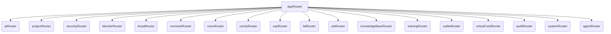

# Omnecor tRPC API Documentation

Omnecor utilizes tRPC as its primary API layer, providing a fully type-safe and efficient way for the frontend to communicate with the backend. This document outlines the structure, usage, and key features of the Omnecor tRPC API.

## 1. Overview

tRPC allows you to build end-to-end type-safe APIs without GraphQL or REST. It leverages TypeScript to infer types across the entire stack, from the backend server to the frontend client. All Omnecor tRPC endpoints are accessible under the `/api/trpc/` path.

### 1.1. Key Benefits

-   **End-to-End Type Safety**: Ensures that API requests and responses adhere to defined types, catching errors at compile time rather than runtime.
-   **Developer Experience**: Provides auto-completion and immediate feedback in the IDE, significantly improving development speed.
-   **No Code Generation**: Unlike GraphQL or OpenAPI, tRPC doesn't require separate code generation steps.
-   **Lightweight**: Minimal overhead, focusing on developer productivity.

## 2. API Structure

The Omnecor tRPC API is organized into a root `appRouter` (`server/routers/index.ts`) which aggregates various sub-routers. Each sub-router is responsible for a specific domain or feature area.



### 2.1. Routers

Each router (`server/routers/*.ts` and `server/phase2/routers/*.ts`) defines a set of procedures (queries, mutations, and subscriptions) related to its domain.

**Examples**:
-   `aiRouter.ts`: Procedures for interacting with AI models, managing providers, and inference.
-   `projectRouter.ts`: Procedures for managing projects, neural workspaces, and associated data.
-   `securityRouter.ts`: Procedures for authentication, authorization, and user management.
-   `blenderRouter.ts`: Procedures for interacting with the Blender bridge.

### 2.3. Procedure Metadata Tags

Omnecor uses two special metadata tags to classify procedures by their sovereignty requirements:

#### `cloudProcedure`
Any tRPC procedure that makes an outbound call to a third-party cloud service (OpenAI, Anthropic, Fal.ai, Lithic, etc.) must be tagged with `cloudProcedure`. Example:

```typescript
export const myCloudRouter = createTRPCRouter({
  generateImage: cloudProcedure
    .input(z.object({ prompt: z.string() }))
    .mutation(async ({ input }) => { /* fal.ai call */ }),
});
```

#### `adminProcedure`
Procedures that require `role = 'admin'` or `role = 'owner'` use `adminProcedure`. These are inaccessible to standard `user` or `viewer` roles and will throw `UNAUTHORIZED` if called without the correct role.

#### `sovereignCheck` Middleware
All `cloudProcedure` calls are automatically wrapped by the `sovereignCheck` middleware (defined in `server/_core/trpc.ts`). If the requesting user's `executionMode` is `'sovereign'`, the middleware throws a `FORBIDDEN` error before the procedure body executes. This enforces strict data locality at the API layer — no cloud bytes escape.

### 2.2. Procedures

tRPC procedures are the actual API endpoints. They can be:

-   **Queries**: For fetching data (read-only operations).
-   **Mutations**: For creating, updating, or deleting data (write operations).
-   **Subscriptions**: For real-time, event-driven data streams (used in conjunction with WebSockets).

Each procedure defines its input schema (using Zod for validation) and its output type, ensuring strict type adherence.

## 3. Usage from Frontend

On the frontend, `@trpc/react-query` is used to interact with the tRPC API. This provides React hooks for easily calling backend procedures, managing loading states, caching, and error handling.

### 3.1. Example: Fetching AI Models

```typescript
import { trpc } from "../lib/trpc";

function MyComponent() {
  const { data: models, isLoading, error } = trpc.ai.getModels.useQuery();

  if (isLoading) return <div>Loading AI models...</div>;
  if (error) return <div>Error: {error.message}</div>;

  return (
    <div>
      <h1>Available AI Models</h1>
      <ul>
        {models?.map((model) => (
          <li key={model.id}>{model.name} ({model.provider})</li>
        ))}
      </ul>
    </div>
  );
}
```

### 3.2. Example: Creating a Chat Session

```typescript
import { trpc } from "../lib/trpc";
import { useState } from "react";

function CreateChatSession() {
  const [title, setTitle] = useState("");
  const createSession = trpc.chat.createSession.useMutation();

  const handleSubmit = async () => {
    try {
      await createSession.mutateAsync({ title, providerId: "ollama", modelId: "llama2" });
      alert("Chat session created!");
      setTitle("");
    } catch (error) {
      alert("Error creating session: " + error.message);
    }
  };

  return (
    <div>
      <input
        type="text"
        value={title}
        onChange={(e) => setTitle(e.target.value)}
        placeholder="Session Title"
      />
      <button onClick={handleSubmit} disabled={createSession.isLoading}>
        {createSession.isLoading ? "Creating..." : "Create Session"}
      </button>
    </div>
  );
}
```

## 4. Context (`server/_core/context.ts`)

The `createContext` function is executed for every incoming request and provides access to various services and utilities that tRPC procedures might need. This is where singleton service instances (e.g., `SecurityService`, `VectorDBService`) are made available.

## 5. Error Handling

tRPC provides robust error handling. Errors thrown in backend procedures are automatically serialized and sent to the frontend, where `@trpc/react-query` handles them gracefully. Custom error types can be defined for more specific error messages.

## 6. Extensibility

Omnecor's tRPC API is designed to be extensible. Developers can easily add new routers and procedures to integrate new features or third-party modules, maintaining type safety across the entire application.

## 7. Missing Routers Reference

### 7.1. `wallet` Router
Manages per-project AI spend budgets. All write procedures are `cloudProcedure` by convention since they interact with cloud billing.

| Procedure | Type | Description |
|---|---|---|
| `wallet.getBudget` | Query | Returns the current `ProjectBudget` for a given `projectId`. |
| `wallet.setBudget` | Mutation | Creates or updates the budget limit and alert threshold for a project. |
| `wallet.getSpendSummary` | Query | Returns aggregated spend from `spend_log` grouped by provider and model for a given time range. |

### 7.2. `virtualCard` Router
Manages Lithic virtual credit cards for financial isolation per project or agent. Requires `LITHIC_API_KEY` in `.env`.

| Procedure | Type | Description |
|---|---|---|
| `virtualCard.issueCard` | Mutation (`cloudProcedure`) | Issues a new Lithic virtual card scoped to a project, with optional spend limits mirroring the project budget. |
| `virtualCard.getCardStatus` | Query (`cloudProcedure`) | Returns the current status, spend, and limits of an issued virtual card. |

### 7.3. `audit` Router
Access to the append-only audit log. Entries can never be edited; the only deletion path is the time-based retention purge (default **14 days**, configurable in Settings → Security). All procedures require `adminProcedure`.

| Procedure | Type | Description |
|---|---|---|
| `audit.getAuditLog` | Query (`adminProcedure`) | Returns paginated audit log entries, filterable by `eventType`, `actorId`, and date range. |
| `audit.getAuditLogByActor` | Query (`adminProcedure`) | Returns recent entries for a specific actor. |
| `audit.exportAuditLog` | Query (`adminProcedure`) | Returns the audit log as CSV (formula-injection-safe escaping). |
| `audit.getRetention` | Query (`adminProcedure`) | Returns the current retention window (14 / 28 / 0 = permanent) plus storage stats (entry count, approximate table size, oldest entry). |
| `audit.setRetention` | Mutation (`adminProcedure`) | Sets the retention window. Applies immediately (shrinking the window purges out-of-window entries) and the change itself is written to the audit log. A background sweep enforces the window every 6 hours. |

### 7.4. `system` Router
System-wide configuration procedures.

| Procedure | Type | Description |
|---|---|---|
| `system.setExecutionMode` | Mutation | Updates the authenticated user's `executionMode` to `sovereign`, `scrapper`, or `big_spender`. Immediately enforced by subsequent `sovereignCheck` calls. |
| `system.loginProviders` | Query | Returns the list of enabled OAuth providers (google, microsoft) based on which client IDs are configured in `.env`. |

### 7.5. `training` Router (Valet Dataset)

| Procedure | Type | Description |
|---|---|---|
| `training.generateValetDataset` | Mutation | Triggers the Valet Router dataset builder. Samples recent `audit_log` + `spend_log` entries and generates labeled JSONL training examples across the 10-category routing taxonomy. Output is saved locally for fine-tuning. |

### 7.6. `honcho` Router
Manages user facts and persistent session memory via the Honcho service. All procedures use `publicProcedure` so they work in zero-login mode (the `openId` is provided by the client). When `HONCHO_API_KEY` is unset, writes are no-ops and reads return empty arrays.

| Procedure | Type | Input | Output | Description |
|---|---|---|---|---|
| `honcho.addMessage` | Mutation | `{ openId: string, sessionId: string, role: "user"\|"ai", content: string }` | `{ ok: true }` | Fire-and-forget sync of a chat message to Honcho session memory. |
| `honcho.addFact` | Mutation | `{ openId: string, content: string (1..2000 chars) }` | `{ ok: true }` | Persists a `/btw` note as a long-term fact (metamessage with label `omnecor_fact`). |
| `honcho.getFacts` | Query | `{ openId: string, limit?: number (1..50, default 20) }` | `Array<{ id: string, content: string, created_at: string }>` | Retrieve recent facts ordered newest-first; used to inject long-term preferences into the system prompt. |

### 7.7. `valet` Router (Additions)

The `valet` router includes the following additional procedure not previously documented:

| Procedure | Type | Input | Output | Description |
|---|---|---|---|---|
| `valet.refreshKnowledge` | Mutation | (none) | `{ reloaded: boolean, embeddingJobId?: string }` | Triggers a hot-reload of the Valet knowledge base. Calls `/admin/reload` on the inference server and spawns `valet_knowledge_refresh.py` to bump `knowledge_base_version`, re-embed KB chunks into ChromaDB, and perform a second reload. |

### 7.8. `notifications` Router (Unified Alerts)

Backs the Notifications tab in the main GUI and the Android APK. State lives in the in-memory `NotificationService`; live pushes arrive on the `notifications` WebSocket channel. All procedures are `protectedProcedure`.

| Procedure | Type | Input | Output | Description |
|---|---|---|---|---|
| `notifications.list` | Query | (none) | `{ notifications: OmnecorNotification[]; unread: number }` | Full feed (newest-first) plus the unread count. |
| `notifications.unreadCount` | Query | (none) | `{ unread: number }` | Cheap polling fallback for the nav badge. |
| `notifications.markRead` | Mutation | `{ id }` | `{ success }` | Marks one notification read. |
| `notifications.markAllRead` | Mutation | (none) | `{ success, flipped }` | Marks every notification read. |
| `notifications.clear` | Mutation | (none) | `{ success }` | Removes all notifications. |
| `notifications.create` | Mutation | `{ kind, title, body, href?, data? }` | `{ notification }` | Push an alert. `kind ∈ chat \| task \| hitl \| wallet \| agent \| system`. |

Notifications are raised automatically by: blocking `ai.chat` completions (`chat`), `processManager` lifecycle completed/failed (`task`), HITL `actionPending` (`hitl`), and agentic-wallet budget threshold/limit crossings (`wallet`). See `shared/notifications.ts` for the `OmnecorNotification` shape.

### 7.9. `agentMessenger` Router (Agent Messenger)

WhatsApp/Discord-style threads with agents/personas, separate from project chats. One thread per persona; replies are generated through the persona's `modelConfig` backend and raise an `agent` notification. Threads live in the in-memory `AgentMessengerStore`. All procedures are `protectedProcedure`.

| Procedure | Type | Input | Output | Description |
|---|---|---|---|---|
| `agentMessenger.listConversations` | Query | (none) | `{ conversations: AgentConversation[] }` | One entry per persona with last message + unread count. |
| `agentMessenger.getMessages` | Query | `{ personaId }` | `{ messages: AgentMessage[] }` | Ordered thread (oldest-first); marks the thread read. |
| `agentMessenger.markRead` | Mutation | `{ personaId }` | `{ success }` | Marks a thread read without fetching. |
| `agentMessenger.send` | Mutation | `{ personaId, content }` | `{ reply: AgentMessage }` | Stores the user turn, generates + stores the agent reply, raises an `agent` notification. |
