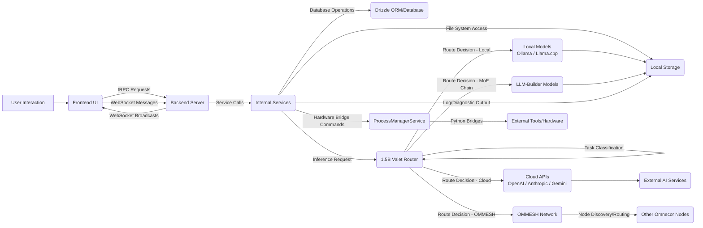

# Omnecor Data Flow

Understanding the data flow within Omnecor is crucial for comprehending how its various components interact to deliver a unified AI workstation experience. This document outlines the primary paths and processes that enable seamless communication between the frontend, backend, AI models, and distributed nodes within the OMMESH network.

## 1. Overview of Data Paths

Data in Omnecor primarily flows between the Frontend, Backend, various internal Services, AI Models (both local and cloud-based), and the OMMESH network. Real-time updates and asynchronous operations ensure responsive interactions and distributed task processing.

## 2. Detailed Data Flow by Component

### 2.1. User Interaction to Frontend

-   **Input**: Users interact with the Omnecor UI through keyboard, mouse, and voice commands.
-   **Processing**: The React frontend captures these interactions, managing local UI state and preparing data for backend communication.
-   **Output**: Visual updates on the screen, and structured data sent to the backend via tRPC or WebSockets.

### 2.2. Frontend to Backend Communication

-   **tRPC Requests**: For synchronous data operations (e.g., fetching project details, saving configurations, initiating tasks), the frontend sends type-safe tRPC requests to the `/api/trpc` endpoint.
-   **WebSocket Messages**: For real-time updates (e.g., chat messages, Neural Node-Tree changes, training progress, hardware job status), the frontend establishes a WebSocket connection to `/ws`. Messages are JSON-formatted and include metadata for routing and processing.

### 2.3. Backend Processing and Service Orchestration

-   **Request Handling**: The Express.js server receives incoming tRPC requests and WebSocket messages. tRPC requests are routed to the appropriate backend routers and context factories.
-   **Service Invocation**: Backend routers and services (e.g., `AgentService`, `ProjectService`, `SecurityService`) process the incoming data. This often involves:
    -   **Database Interactions**: Reading from or writing to the Drizzle ORM-managed database (e.g., project metadata, user settings).
    -   **File System Operations**: Accessing local files for project assets, configurations, or storing AI-generated outputs.
    -   **AI Model Orchestration**: The `AiProviderService` routes AI inference requests to the `AI Model Hub`.
    -   **Process Management**: The `ProcessManagerService` spawns and manages child processes for hardware bridges (e.g., Blender, KiCad, ESPTool), streaming their outputs back to the backend.
    -   **OMMESH Interactions**: The `MeshDiscoveryService` and `RoutingEngine` handle communication with other Omnecor nodes for distributed tasks.
-   **Security**: The `SecurityService` applies authentication, authorization, and data encryption as data is processed or stored.

### 2.4. AI Model Data Flow

#### 2.4.1. Valet Router Dispatch Layer

All inference requests from internal services pass through the **1.5B Valet Router** before reaching any model. The Valet runs entirely locally — the routing decision itself never makes a cloud call.

**Dispatch sequence:**
1. Internal service sends task to `AiProviderService`
2. `AiProviderService` forwards to the Valet Router (local inference)
3. Valet classifies the task into one of 10 categories (research, code_generation, synthesis, etc.)
4. Valet selects the routing target based on the user's configured Valet routing mode (see [VALET_ROUTER.md](../ai-agents/VALET_ROUTER.md))
5. Valet dispatches to the selected provider(s) or chain

**sovereignCheck interaction:** Before any cloud dispatch, the `sovereignCheck` middleware verifies that the user's Execution Mode is not `sovereign`. If it is, the dispatch throws `FORBIDDEN` and the Valet falls back to local routing automatically.

#### 2.4.2. Local Model Path

For local models (Ollama / Llama.cpp), requests are routed to the local inference server. Input data (prompts, context, embeddings) is processed on-device, and results are returned to `AiProviderService`.

#### 2.4.3. Cloud API Path

For cloud-based models, requests pass through `sovereignCheck` middleware first. If permitted, they are sent to external API endpoints. API keys are managed by `SecurityService` and never logged (redacted before any audit entry).

#### 2.4.4. OMMESH Path

For OMMESH-targeted routing, the `RoutingEngine` selects the peer node with the most available VRAM and forwards the inference request over the mTLS-secured mesh connection. In `moe_chain_omesh` mode, OMMESH tasks are dispatched before the local chain begins.

#### 2.4.5. MoE Chain Path

For `moe_chain` and `moe_chain_omesh` modes, the Valet sequences tasks through multiple locally-stored LLM-Builder fine-tuned models. Only one model runs at a time to conserve GPU/CPU resources. Output of each step becomes input to the next.

#### 2.4.6. Memory Layer

The `VectorDBService` stores and retrieves embeddings for RAG across all routing paths. The Valet queries the Neural Brain Map before dispatching context-sensitive tasks to ensure the selected provider receives the most relevant project context.

### 2.5. OMMESH Data Flow

-   **Node Discovery**: Omnecor nodes broadcast their presence on the local network using Bonjour. The `MeshDiscoveryService` listens for and registers other nodes.
-   **Secure Communication**: All inter-node communication is secured via mTLS, ensuring data integrity and confidentiality.
-   **Distributed Inference**: When a task requires distributed processing, the `RoutingEngine` determines the optimal node based on available resources (e.g., VRAM) and routes the inference request appropriately.

### 2.6. Cross-Session Memory (Honcho)

The `HonchoService` persists user facts, conversation history, and preferences across sessions:

-   **User Facts**: Commands like `/btw` store durable user facts as Honcho metamessages (labeled `omnecor_fact`). Recent facts are injected into the chat system prompt on each new session.
-   **Session History**: Conversation messages are synced to Honcho for long-term memory retrieval and context enrichment.
-   **Graceful Degradation**: If `HONCHO_API_KEY` is not set, all Honcho operations become no-ops (no writes, empty reads), and the system continues with local memory only (VectorDB + MemoryArchitectService).
-   **API Hierarchy**: Honcho uses app → user → session → messages + metamessages structure, enabling multi-session, per-user fact tracking.

### 2.7. Context Management

The `MemoryArchitectService` and frontend context controls ensure efficient token usage:

-   **Hierarchical Context**: Three-tier system with permanent Goal & Plan buffer (never pruned), conversation history (pruned when over token limits), and rolling terminal log (auto-summarized after 50 entries).
-   **Token Budget Visualization**: Client-side token-usage bar shows amber at 70% capacity and red at 90%, allowing users to monitor and preemptively manage context.
-   **Manual Pruning**: `/compress` command summarizes old entries; per-message exclusion toggles allow selective context inclusion.
-   **Routing Categories**: The Valet Router dispatches `context_management` and `memory_operations` tasks to manage these systems; see [VALET_ROUTER.md](../ai-agents/VALET_ROUTER.md).

### 2.8. Backend to Frontend Updates

-   **WebSocket Broadcasts**: After processing, the backend broadcasts real-time updates and results back to connected frontend clients via WebSockets. This includes task progress, chat responses, and hardware events.
-   **tRPC Responses**: Synchronous tRPC requests receive their responses directly, updating the UI state accordingly.

## 3. Data Persistence

-   **Database**: Structured data (e.g., user preferences, project configurations, task queues) is persisted in the database via Drizzle ORM.
-   **File System**: Unstructured data, such as project files, AI model weights, generated media, and log files, are stored directly on the local file system. The `FileSystemWatcherService` monitors changes to project files and triggers appropriate backend events.
-   **Context Persistence**: The `MemoryArchitectService` and `VectorDBService` ensure that AI context and semantic memory are persistently stored and available across sessions.
-   **Cross-Session Memory**: The `HonchoService` persists user facts and preferences across sessions via the Honcho external memory service. When enabled, these are queried and injected into the system prompt on each new conversation.
