# Omnecor Database Schema

Omnecor utilizes Drizzle ORM for its database interactions, providing a type-safe and robust way to manage application data. The schema is defined in `drizzle/schema.ts` and supports MySQL/TiDB. This document outlines the key tables and their relationships within the Omnecor database.

## 1. Overview

The database schema is designed to support core application functionalities, including user management, chat sessions, and message persistence. It is structured to be extensible, allowing for the addition of new tables as the product evolves.

## 2. Table Definitions

### 2.1. `users` Table

This table stores core user information, backing the authentication flow. It is designed to be extended with additional user-related data as needed.

| Column Name | Type | Description | Constraints |
|---|---|---|---|
| `id` | `int` | Surrogate primary key. Auto-incremented numeric value. | `PRIMARY KEY`, `AUTO_INCREMENT` |
| `openId` | `varchar(64)` | OAuth provider subject identifier returned from the OAuth callback. | `NOT NULL`, `UNIQUE` |
| `name` | `text` | User's display name. | |
| `email` | `varchar(320)` | User's email address. | |
| `loginMethod` | `varchar(64)` | Method used for user login. Supports `'google'`, `'microsoft'`, `'local'`. | |
| `role` | `enum('viewer', 'user', 'admin', 'owner')` | User's role within the system. | `NOT NULL`, `DEFAULT 'user'` |
| `executionMode` | `mysqlEnum('executionMode', ['sovereign', 'scrapper', 'big_spender'])` | Controls which execution mode this user prefers. | `NOT NULL`, `DEFAULT 'scrapper'` |
| `createdAt` | `timestamp` | Timestamp of user creation. | `NOT NULL`, `DEFAULT CURRENT_TIMESTAMP` |
| `updatedAt` | `timestamp` | Timestamp of last update to user record. | `NOT NULL`, `DEFAULT CURRENT_TIMESTAMP ON UPDATE CURRENT_TIMESTAMP` |
| `lastSignedIn` | `timestamp` | Timestamp of the user's last sign-in. | `NOT NULL`, `DEFAULT CURRENT_TIMESTAMP` |

### 2.2. `chat_sessions` Table

This table represents individual conversation threads with an AI provider, enabling chat persistence.

| Column Name | Type | Description | Constraints |
|---|---|---|---|
| `id` | `varchar(36)` | Unique identifier for the chat session (UUID). | `PRIMARY KEY` |
| `projectId` | `varchar(64)` | Identifier for the project associated with the chat session. | `NOT NULL` |
| `title` | `text` | Title or brief description of the chat session. | `NOT NULL` |
| `providerId` | `varchar(64)` | Identifier of the AI provider used for the session. | `NOT NULL` |
| `modelId` | `varchar(64)` | Identifier of the specific AI model used for the session. | `NOT NULL` |
| `systemPrompt` | `text` | The system prompt used to initialize the chat session. | |
| `metadata` | `json` | JSON object for storing additional session metadata. | |
| `createdAt` | `timestamp` | Timestamp of session creation. | `NOT NULL`, `DEFAULT CURRENT_TIMESTAMP` |
| `updatedAt` | `timestamp` | Timestamp of last update to session record. | `NOT NULL`, `DEFAULT CURRENT_TIMESTAMP ON UPDATE CURRENT_TIMESTAMP` |

### 2.3. `chat_messages` Table

This table stores individual messages within a chat session, maintaining the conversation history.

| Column Name | Type | Description | Constraints |
|---|---|---|---|
| `id` | `varchar(36)` | Unique identifier for the message (UUID). | `PRIMARY KEY` |
| `sessionId` | `varchar(36)` | Foreign key referencing the `chat_sessions` table. | `NOT NULL`, `REFERENCES chat_sessions(id) ON DELETE CASCADE` |
| `role` | `enum('system', 'user', 'assistant', 'tool', 'function')` | Role of the message sender. | `NOT NULL` |
| `content` | `text` | The content of the message (text or JSON for tool calls). | `NOT NULL` |
| `tokenCount` | `int` | Number of tokens in the message content. | |
| `createdAt` | `timestamp` | Timestamp of message creation. | `NOT NULL`, `DEFAULT CURRENT_TIMESTAMP` |

### 2.4. `integrations` Table

Stores per-user OAuth tokens for third-party provider integrations (e.g. Google, Microsoft, Lithic). Tokens are stored encrypted using AES-GCM.

| Column Name | Type | Description | Constraints |
|---|---|---|---|
| `id` | `varchar(36)` | UUID | `PRIMARY KEY` |
| `provider` | `varchar(64)` | OAuth provider name (e.g. `'google'`, `'microsoft'`, `'lithic'`) | `NOT NULL` |
| `accessToken` | `text` | Encrypted access token | `NOT NULL` |
| `refreshToken` | `text` | Encrypted refresh token | |
| `expiresAt` | `timestamp` | Token expiry | |
| `tokenIv` | `varchar(64)` | AES-GCM IV used for token encryption | |
| `tokenTag` | `varchar(64)` | AES-GCM authentication tag | |
| `createdAt` | `timestamp` | Timestamp of record creation | `NOT NULL`, `DEFAULT CURRENT_TIMESTAMP` |
| `updatedAt` | `timestamp` | Timestamp of last update | `NOT NULL`, `DEFAULT CURRENT_TIMESTAMP ON UPDATE CURRENT_TIMESTAMP` |

### 2.5. `project_budgets` Table

Defines per-project spending limits and alerting behaviour. The `mode` column controls whether the budget acts as a soft warning or a hard block.

| Column Name | Type | Description | Constraints |
|---|---|---|---|
| `id` | `varchar(36)` | UUID | `PRIMARY KEY` |
| `projectId` | `varchar(64)` | Associated project identifier | `NOT NULL` |
| `limitCents` | `int` | Hard limit in cents. `0` = unlimited. | `NOT NULL`, `DEFAULT 0` |
| `alertThreshold` | `int` | Alert trigger as a percentage (e.g. `80` = 80%) | `NOT NULL`, `DEFAULT 80` |
| `mode` | `enum('soft', 'hard')` | `soft` = alert only; `hard` = block + auto-downgrade to Ollama | `NOT NULL`, `DEFAULT 'soft'` |
| `createdAt` | `timestamp` | Timestamp of record creation | `NOT NULL` |
| `updatedAt` | `timestamp` | Timestamp of last update | `NOT NULL` |

### 2.6. `spend_log` Table

> **INSERT-ONLY.** No `UPDATE` or `DELETE` is ever performed on this table. It is an immutable ledger of AI provider spend per session.

| Column Name | Type | Description | Constraints |
|---|---|---|---|
| `id` | `varchar(36)` | UUID | `PRIMARY KEY` |
| `projectId` | `varchar(64)` | Project this spend belongs to | `NOT NULL` |
| `provider` | `varchar(64)` | AI provider (e.g. `'openai'`, `'anthropic'`, `'ollama'`) | `NOT NULL` |
| `modelId` | `varchar(64)` | Model identifier | `NOT NULL` |
| `promptTokens` | `int` | Input token count | `NOT NULL`, `DEFAULT 0` |
| `completionTokens` | `int` | Output token count | `NOT NULL`, `DEFAULT 0` |
| `estimatedCostMicrocents` | `bigint` | Cost estimate in microcents (1/100 of a cent) for precision | `NOT NULL`, `DEFAULT 0` |
| `sessionId` | `varchar(36)` | Optional link to `chat_sessions` | |
| `createdAt` | `timestamp` | Timestamp of record creation | `NOT NULL` |

### 2.7. `audit_log` Table

> **APPEND-ONLY.** No `UPDATE` is ever performed and application code cannot delete entries. The only deletion path is the time-based retention purge in `AuditLogService` (default 14 days; configurable to 28 days or permanent in Settings → Security). Sensitive data is redacted before insertion via `redactSensitiveData()`.

| Column Name | Type | Description | Constraints |
|---|---|---|---|
| `id` | `varchar(36)` | UUID | `PRIMARY KEY` |
| `eventType` | `varchar(64)` | Event type string (e.g. `'user.login'`, `'hitl.approved'`, `'agent.spawned'`) | `NOT NULL` |
| `actorId` | `int` | FK to `users.id`. `NULL` for system-initiated events. | |
| `actorType` | `varchar(32)` | `'user'`, `'agent'`, or `'system'` | `NOT NULL`, `DEFAULT 'user'` |
| `procedure` | `varchar(128)` | tRPC procedure path that triggered the event | |
| `args` | `json` | Redacted input arguments | |
| `result` | `json` | Redacted result summary | |
| `ipAddress` | `varchar(64)` | Client IP address | |
| `sessionId` | `varchar(36)` | Associated chat or pipeline session | |
| `createdAt` | `timestamp` | Timestamp of record creation | `NOT NULL` |

Captured event types include: `user.login`, `user.logout`, `hitl.approved`, `hitl.rejected`, `agent.spawned`, `agent.terminated`, `budget.changed`, `card.issued`, `tool.blender`, `tool.kicad`, `tool.esptool`.

### 2.8. `pipelines` Table

Represents a top-level multi-phase execution pipeline, progressing through DEFINE → PLAN → EXECUTE → REVIEW → SHIP → DONE.

| Column Name | Type | Description | Constraints |
|---|---|---|---|
| `id` | `varchar(36)` | UUID | `PRIMARY KEY` |
| `name` | `varchar(128)` | Human-readable pipeline name | `NOT NULL` |
| `goal` | `text` | High-level goal description for the pipeline | |
| `status` | `enum('pending', 'running', 'paused', 'complete', 'aborted')` | Overall pipeline status | `NOT NULL`, `DEFAULT 'pending'` |
| `currentPhase` | `enum('DEFINE', 'PLAN', 'EXECUTE', 'REVIEW', 'SHIP', 'DONE')` | Active phase of the pipeline | `NOT NULL`, `DEFAULT 'DEFINE'` |
| `ownerId` | `int` | FK to `users.id`. User who owns this pipeline. | |
| `createdAt` | `timestamp` | Timestamp of record creation | `NOT NULL` |
| `updatedAt` | `timestamp` | Timestamp of last update | `NOT NULL` |

### 2.9. `pipeline_phases` Table

Stores per-phase state and HITL approval records for a pipeline run. Phases are deleted when their parent pipeline is deleted.

| Column Name | Type | Description | Constraints |
|---|---|---|---|
| `id` | `varchar(36)` | UUID | `PRIMARY KEY` |
| `pipelineId` | `varchar(36)` | FK to `pipelines.id` | `NOT NULL`, `REFERENCES pipelines(id) ON DELETE CASCADE` |
| `phase` | `enum('DEFINE', 'PLAN', 'EXECUTE', 'REVIEW', 'SHIP')` | Phase identifier | `NOT NULL` |
| `status` | `enum('pending', 'awaiting_approval', 'approved', 'rejected', 'complete')` | Phase status | `NOT NULL`, `DEFAULT 'pending'` |
| `inputText` | `text` | Input provided to this phase | |
| `outputText` | `text` | Output produced by this phase | |
| `approvedBy` | `int` | FK to `users.id`. User who approved this phase. | |
| `approvedAt` | `timestamp` | Timestamp of approval | |
| `createdAt` | `timestamp` | Timestamp of record creation | `NOT NULL` |
| `updatedAt` | `timestamp` | Timestamp of last update | `NOT NULL` |

### 2.10. `cloud_compute_sessions` Table

Tracks rented GPU/compute sessions across providers (VastAI, RunPod, Lambda). Integrates with the Agentic Wallet spend log on session stop.

| Column Name | Type | Description | Constraints |
|---|---|---|---|
| `id` | `varchar(36)` | UUID | `PRIMARY KEY` |
| `userId` | `int` | FK to `users.id`. User who owns this compute session. | `NOT NULL` |
| `projectId` | `varchar(64)` | Associated project identifier | `NOT NULL` |
| `provider` | `varchar(64)` | Compute provider name (`'vastai'`, `'runpod'`, `'lambda'`) | `NOT NULL` |
| `externalSessionId` | `varchar(128)` | External session identifier from the cloud provider | |
| `planId` | `varchar(64)` | Cloud provider plan identifier | `NOT NULL` |
| `instanceLabel` | `varchar(128)` | Human-readable instance label | `NOT NULL` |
| `billingUnit` | `enum('minute', 'hour')` | Billing unit for cost calculation | `NOT NULL`, `DEFAULT 'hour'` |
| `ratePerUnitMicrocents` | `bigint` | Cost per billing unit in microcents | `NOT NULL` |
| `status` | `enum('starting', 'running', 'stopped', 'error')` | Session status | `NOT NULL`, `DEFAULT 'starting'` |
| `startedAt` | `timestamp` | Timestamp when session started | `NOT NULL`, `DEFAULT CURRENT_TIMESTAMP` |
| `stoppedAt` | `timestamp` | Timestamp when session stopped (if applicable) | |
| `totalCostMicrocents` | `bigint` | Total cost in microcents for this session | `NOT NULL`, `DEFAULT 0` |
| `metadata` | `json` | Additional session metadata (JSON object) | |
| `createdAt` | `timestamp` | Timestamp of record creation | `NOT NULL`, `DEFAULT CURRENT_TIMESTAMP` |

### 2.11. `cloud_compute_subscriptions` Table

Tracks monthly subscription plans a user has with cloud compute providers (e.g. RunPod monthly credit pack).

| Column Name | Type | Description | Constraints |
|---|---|---|---|
| `id` | `varchar(36)` | UUID | `PRIMARY KEY` |
| `userId` | `int` | FK to `users.id`. User who owns this subscription. | `NOT NULL` |
| `provider` | `varchar(64)` | Compute provider name | `NOT NULL` |
| `planName` | `varchar(128)` | Name of the subscription plan | `NOT NULL` |
| `monthlyCents` | `int` | Monthly cost in cents | `NOT NULL`, `DEFAULT 0` |
| `renewalDate` | `timestamp` | Date when subscription renews | |
| `isActive` | `int` | Boolean flag (0 = inactive, 1 = active) | `NOT NULL`, `DEFAULT 1` |
| `apiKeyHint` | `varchar(32)` | Last few characters of API key (for identification) | |
| `notes` | `text` | Additional notes about the subscription | |
| `createdAt` | `timestamp` | Timestamp of record creation | `NOT NULL`, `DEFAULT CURRENT_TIMESTAMP` |
| `updatedAt` | `timestamp` | Timestamp of last update | `NOT NULL`, `DEFAULT CURRENT_TIMESTAMP ON UPDATE CURRENT_TIMESTAMP` |

### 2.12. `platformAccounts` Table

Stores OAuth-connected social media platform accounts. Tokens are stored encrypted. Used for the social media integration and content curation features.

| Column Name | Type | Description | Constraints |
|---|---|---|---|
| `id` | `int` | Auto-incremented primary key | `PRIMARY KEY`, `AUTO_INCREMENT` |
| `userId` | `int` | FK to `users.id`. User who owns this platform account. | `NOT NULL` |
| `platform` | `varchar(50)` | Platform name (`'twitter'`, `'linkedin'`, `'facebook'`, etc.) | `NOT NULL` |
| `accountName` | `varchar(255)` | Display name of the account on the platform | |
| `oauthToken` | `text` | Encrypted OAuth access token | `NOT NULL` |
| `oauthRefreshToken` | `text` | Encrypted OAuth refresh token (if applicable) | |
| `tokenExpiresAt` | `timestamp` | Timestamp when the OAuth token expires | |
| `accountMetadata` | `json` | Platform-specific metadata (JSON object) | |
| `isActive` | `int` | Boolean flag (0 = inactive, 1 = active) | `DEFAULT 1` |
| `lastSyncedAt` | `timestamp` | Timestamp of last sync with the platform | |
| `createdAt` | `timestamp` | Timestamp of record creation | `NOT NULL`, `DEFAULT CURRENT_TIMESTAMP` |
| `updatedAt` | `timestamp` | Timestamp of last update | `NOT NULL`, `DEFAULT CURRENT_TIMESTAMP ON UPDATE CURRENT_TIMESTAMP` |

### 2.13. `oauthStates` Table

Transient OAuth state for the social-media connect flow. Stores CSRF tokens and PKCE verifiers. Persisted so the flow survives server restarts and works across multiple instances behind a load balancer. Rows are single-use and expire; `expiresAt` is enforced on read and old rows are swept opportunistically.

| Column Name | Type | Description | Constraints |
|---|---|---|---|
| `state` | `varchar(128)` | The opaque state token (also serves as CSRF nonce) | `PRIMARY KEY` |
| `platform` | `varchar(50)` | Platform name for this OAuth flow | `NOT NULL` |
| `userId` | `int` | FK to `users.id`. User initiating the OAuth flow. | `NOT NULL` |
| `codeVerifier` | `varchar(256)` | PKCE code_verifier (when the provider uses PKCE) | |
| `expiresAt` | `timestamp` | Timestamp when this state token expires | `NOT NULL` |
| `createdAt` | `timestamp` | Timestamp of record creation | `NOT NULL`, `DEFAULT CURRENT_TIMESTAMP` |

### 2.14. `discoveredArticles` Table

Stores articles found by the content discovery engine. These articles are candidates for curation into social media posts.

| Column Name | Type | Description | Constraints |
|---|---|---|---|
| `id` | `int` | Auto-incremented primary key | `PRIMARY KEY`, `AUTO_INCREMENT` |
| `title` | `varchar(500)` | Title of the article | |
| `url` | `varchar(2048)` | URL of the article | `UNIQUE` |
| `urlHash` | `varchar(64)` | Hash of the URL for deduplication | `UNIQUE` |
| `source` | `varchar(100)` | Source publication or website name | |
| `content` | `text` | Full text content of the article (if fetched) | |
| `summary` | `text` | AI-generated summary of the article | |
| `publishedAt` | `timestamp` | Timestamp when the article was published | |
| `fetchedAt` | `timestamp` | Timestamp when the article content was fetched | `DEFAULT CURRENT_TIMESTAMP` |
| `isProcessed` | `int` | Boolean flag (0 = unprocessed, 1 = processed) | `DEFAULT 0` |
| `createdAt` | `timestamp` | Timestamp of record creation | `NOT NULL`, `DEFAULT CURRENT_TIMESTAMP` |

### 2.15. `curatedPosts` Table

AI-curated content drafts intended for publishing to social media platforms. Tracks the curation workflow from draft through approval to publication.

| Column Name | Type | Description | Constraints |
|---|---|---|---|
| `id` | `int` | Auto-incremented primary key | `PRIMARY KEY`, `AUTO_INCREMENT` |
| `articleId` | `int` | FK to `discoveredArticles.id`. Source article (nullable; post may be original). | |
| `platform` | `varchar(50)` | Target platform for this post | `NOT NULL` |
| `content` | `text` | The curated/generated post content | |
| `metadata` | `json` | Additional metadata about the curation (JSON object) | |
| `status` | `enum('draft', 'pending_review', 'approved', 'scheduled', 'published', 'failed')` | Curation workflow status | `DEFAULT 'draft'` |
| `approvalNotes` | `text` | Notes from the approval process | |
| `createdAt` | `timestamp` | Timestamp of record creation | `NOT NULL`, `DEFAULT CURRENT_TIMESTAMP` |
| `updatedAt` | `timestamp` | Timestamp of last update | `NOT NULL`, `DEFAULT CURRENT_TIMESTAMP ON UPDATE CURRENT_TIMESTAMP` |

### 2.16. `scheduledPosts` Table

Posts queued for publishing to a platform via a specific account. Tracks the publishing workflow from scheduled through published or failed.

| Column Name | Type | Description | Constraints |
|---|---|---|---|
| `id` | `int` | Auto-incremented primary key | `PRIMARY KEY`, `AUTO_INCREMENT` |
| `curatedPostId` | `int` | FK to `curatedPosts.id`. The curated post being scheduled. | `NOT NULL` |
| `platformAccountId` | `int` | FK to `platformAccounts.id`. Account to publish via. | `NOT NULL` |
| `scheduledAt` | `timestamp` | Timestamp when the post is scheduled to publish | |
| `publishedAt` | `timestamp` | Timestamp when the post was actually published | |
| `status` | `enum('scheduled', 'published', 'failed', 'cancelled')` | Publishing status | `DEFAULT 'scheduled'` |
| `errorMessage` | `text` | Error details if the post failed to publish | |
| `platformPostId` | `varchar(255)` | External post ID from the platform (e.g. tweet ID) | |
| `createdAt` | `timestamp` | Timestamp of record creation | `NOT NULL`, `DEFAULT CURRENT_TIMESTAMP` |
| `updatedAt` | `timestamp` | Timestamp of last update | `NOT NULL`, `DEFAULT CURRENT_TIMESTAMP ON UPDATE CURRENT_TIMESTAMP` |

### 2.17. `postAnalytics` Table

Engagement metrics for published posts. Records likes, comments, shares, impressions, and other engagement data for analytics and reporting.

| Column Name | Type | Description | Constraints |
|---|---|---|---|
| `id` | `int` | Auto-incremented primary key | `PRIMARY KEY`, `AUTO_INCREMENT` |
| `scheduledPostId` | `int` | FK to `scheduledPosts.id`. The published post being tracked. | `NOT NULL` |
| `impressions` | `int` | Number of times the post was seen | `DEFAULT 0` |
| `reach` | `int` | Number of unique users who saw the post | `DEFAULT 0` |
| `likes` | `int` | Number of likes/reactions | `DEFAULT 0` |
| `shares` | `int` | Number of shares/retweets | `DEFAULT 0` |
| `comments` | `int` | Number of comments/replies | `DEFAULT 0` |
| `clicks` | `int` | Number of clicks (if applicable) | `DEFAULT 0` |
| `engagementRate` | `varchar(10)` | Calculated engagement rate as a percentage string | |
| `lastUpdatedAt` | `timestamp` | Timestamp of last analytics update | `DEFAULT CURRENT_TIMESTAMP ON UPDATE CURRENT_TIMESTAMP` |

### 2.18. `postingScheduleConfig` Table

Configuration for automated posting schedules. Defines how often posts are published and when the optimal posting times are for a given user/platform pair.

| Column Name | Type | Description | Constraints |
|---|---|---|---|
| `id` | `int` | Auto-incremented primary key | `PRIMARY KEY`, `AUTO_INCREMENT` |
| `userId` | `int` | FK to `users.id`. User who owns this configuration. | `NOT NULL` |
| `platform` | `varchar(50)` | Target platform | `NOT NULL` |
| `postsPerDay` | `int` | Target number of posts per day | `DEFAULT 1` |
| `autoApprove` | `int` | Boolean flag (0 = manual approval, 1 = auto-approve) | `DEFAULT 0` |
| `optimalPostingTimes` | `json` | JSON array of optimal posting times (e.g. hours of day) | |
| `timezone` | `varchar(50)` | Timezone for posting schedule calculations | `DEFAULT 'UTC'` |
| `createdAt` | `timestamp` | Timestamp of record creation | `NOT NULL`, `DEFAULT CURRENT_TIMESTAMP` |
| `updatedAt` | `timestamp` | Timestamp of last update | `NOT NULL`, `DEFAULT CURRENT_TIMESTAMP ON UPDATE CURRENT_TIMESTAMP` |

### 2.19. `design_projects` Table

Represents top-level PCB design projects. Users can organize multiple design files (saves) within each project.

| Column Name | Type | Description | Constraints |
|---|---|---|---|
| `id` | `int` | Auto-incremented primary key | `PRIMARY KEY`, `AUTO_INCREMENT` |
| `userId` | `int` | FK to `users.id`. User who owns this design project. | `NOT NULL` |
| `name` | `varchar(255)` | Project name | `NOT NULL` |
| `description` | `text` | Project description | |
| `mode` | `varchar(20)` | Design mode (schematic or PCB layout). Supports `'schematic'`, `'pcb'`. | `NOT NULL`, `DEFAULT 'schematic'` |
| `createdAt` | `timestamp` | Timestamp of record creation | `NOT NULL` |
| `updatedAt` | `timestamp` | Timestamp of last update | `NOT NULL` |

### 2.20. `design_saves` Table

Stores versioned snapshots of PCB design projects. Each save represents a state of the canvas at a point in time.

| Column Name | Type | Description | Constraints |
|---|---|---|---|
| `id` | `int` | Auto-incremented primary key | `PRIMARY KEY`, `AUTO_INCREMENT` |
| `projectId` | `int` | FK to `design_projects.id`. Project this save belongs to. | `NOT NULL` |
| `userId` | `int` | FK to `users.id`. User who owns this save. | `NOT NULL` |
| `name` | `varchar(255)` | Save name or version label | `NOT NULL` |
| `description` | `text` | Save description or notes | |
| `canvasData` | `json` | Complete canvas state (components, connections, layout) | `NOT NULL` |
| `componentCount` | `int` | Number of components in this design | `DEFAULT 0` |
| `connectionCount` | `int` | Number of electrical connections in this design | `DEFAULT 0` |
| `version` | `int` | Version number within the project | `DEFAULT 1` |
| `isLatest` | `int` | Boolean flag (0 = archived, 1 = latest version) | `DEFAULT 1` |
| `createdAt` | `timestamp` | Timestamp of record creation | `NOT NULL` |
| `updatedAt` | `timestamp` | Timestamp of last update | `NOT NULL` |

### 2.21. `component_library_items` Table

Reusable PCB components stored in a user's custom library. Components include schematic symbols, footprints, and electrical properties.

| Column Name | Type | Description | Constraints |
|---|---|---|---|
| `id` | `int` | Auto-incremented primary key | `PRIMARY KEY`, `AUTO_INCREMENT` |
| `userId` | `int` | FK to `users.id`. User who owns this component. | `NOT NULL` |
| `componentId` | `varchar(255)` | Unique identifier for the component (unique per user) | `NOT NULL`, `UNIQUE` |
| `name` | `varchar(255)` | Human-readable component name | `NOT NULL` |
| `category` | `varchar(100)` | Component category (e.g. `'resistor'`, `'capacitor'`, `'ic'`) | `NOT NULL` |
| `description` | `text` | Component description and notes | |
| `symbolSvg` | `text` | SVG representation of the schematic symbol | |
| `footprintSvg` | `text` | SVG representation of the PCB footprint | |
| `properties` | `json` | Electrical properties (resistance, capacitance, ratings, etc.) | `NOT NULL` |
| `handles` | `json` | Connection points/pads for the component | `NOT NULL` |
| `manufacturer` | `varchar(255)` | Component manufacturer name | |
| `partNumber` | `varchar(255)` | Manufacturer part number | |
| `datasheet` | `varchar(512)` | URL to the component datasheet | |
| `tags` | `json` | JSON array of searchable tags | `NOT NULL` |
| `createdAt` | `timestamp` | Timestamp of record creation | `NOT NULL` |
| `updatedAt` | `timestamp` | Timestamp of last update | `NOT NULL` |

### 2.22. `design_exports` Table

Tracks exported design files in various formats (Gerber, DXF, SVG, PDF). Enables users to download their designs for manufacturing or analysis.

| Column Name | Type | Description | Constraints |
|---|---|---|---|
| `id` | `int` | Auto-incremented primary key | `PRIMARY KEY`, `AUTO_INCREMENT` |
| `designSaveId` | `int` | FK to `design_saves.id`. Design being exported. | `NOT NULL` |
| `userId` | `int` | FK to `users.id`. User who requested the export. | `NOT NULL` |
| `format` | `varchar(20)` | Export format (e.g. `'gerber'`, `'dxf'`, `'svg'`, `'pdf'`) | `NOT NULL` |
| `fileUrl` | `varchar(512)` | URL to the exported file | `NOT NULL` |
| `fileSize` | `int` | Size of the exported file in bytes | |
| `createdAt` | `timestamp` | Timestamp of record creation | `NOT NULL` |

### 2.23. `ai_design_reviews` Table

Records of AI-assisted design reviews and critiques. Captures user questions and AI analysis for a given design state.

| Column Name | Type | Description | Constraints |
|---|---|---|---|
| `id` | `int` | Auto-incremented primary key | `PRIMARY KEY`, `AUTO_INCREMENT` |
| `designSaveId` | `int` | FK to `design_saves.id`. Design being reviewed. | `NOT NULL` |
| `userId` | `int` | FK to `users.id`. User requesting the review. | `NOT NULL` |
| `prompt` | `text` | User's question or request for the AI review | `NOT NULL` |
| `response` | `text` | AI's analysis and recommendations | `NOT NULL` |
| `componentCount` | `int` | Component count at review time (context snapshot) | |
| `connectionCount` | `int` | Connection count at review time (context snapshot) | |
| `mode` | `varchar(20)` | Design mode at review time (schematic or PCB) | |
| `createdAt` | `timestamp` | Timestamp of record creation | `NOT NULL` |

### 2.24. `neural_maps` Table

Knowledge maps representing hierarchical directory structures and code relationships. Users create neural maps to visualize project organization and navigate complex codebases.

| Column Name | Type | Description | Constraints |
|---|---|---|---|
| `id` | `varchar(36)` | Unique identifier (UUID from client) | `PRIMARY KEY` |
| `userId` | `int` | FK to `users.id`. User who owns this neural map. | `NOT NULL` |
| `name` | `varchar(255)` | Human-readable neural map name | `NOT NULL` |
| `mode` | `varchar(50)` | Map visualization mode (e.g. `'standard'`, `'compact'`) | `NOT NULL`, `DEFAULT 'standard'` |
| `rootDirectories` | `json` | JSON array of root directory paths to index | `NOT NULL` |
| `projectContext` | `json` | Arbitrary metadata about the project or codebase | |
| `labelOverrides` | `json` | JSON object mapping nodeId to custom display labels | |
| `settings` | `json` | Display and behaviour preferences (zoom, layout, colors, etc.) | `NOT NULL` |
| `createdAt` | `timestamp` | Timestamp of record creation | `NOT NULL` |
| `updatedAt` | `timestamp` | Timestamp of last update | `NOT NULL` |

### 2.25. `personas` Table

AI personas created by users for multi-agent systems and social media integration. Personas define agent identities, behavioural traits, voice characteristics, and tool permissions.

| Column Name | Type | Description | Constraints |
|---|---|---|---|
| `id` | `varchar(36)` | Unique identifier (UUID from client) | `PRIMARY KEY` |
| `userId` | `int` | FK to `users.id`. User who owns this persona. | `NOT NULL` |
| `name` | `varchar(255)` | Persona display name | `NOT NULL` |
| `type` | `varchar(50)` | Persona type. Supports `'self_clone'`, `'social_media'`, `'agent'`. | `NOT NULL`, `DEFAULT 'self_clone'` |
| `alwaysOn` | `int` | Boolean flag (0 = on-demand, 1 = always-on agent) | `NOT NULL`, `DEFAULT 0` |
| `data` | `json` | Complete persona definition: bio, traits, voice config, model config, tool permissions, etc. | `NOT NULL` |
| `createdAt` | `timestamp` | Timestamp of record creation | `NOT NULL` |
| `updatedAt` | `timestamp` | Timestamp of last update | `NOT NULL` |

## 3. Relationships

### Core Chat & Audit

-   **`chat_messages` to `chat_sessions`**: A one-to-many relationship where multiple `chat_messages` can belong to a single `chat_session`. The `sessionId` in `chat_messages` is a foreign key referencing `chat_sessions.id`, with `ON DELETE CASCADE` ensuring that messages are deleted when their parent session is removed.
-   **`audit_log` to `users`**: Many-to-one via `actorId` (nullable). System-initiated events have `actorId = NULL`.

### Budgets & Spending

-   **`project_budgets` to `projects`**: Many-to-one via `projectId`. A project may have at most one active budget record.
-   **`spend_log` to `project_budgets`**: Many-to-one via `projectId`. All spend entries for a project roll up against that project's budget.

### Pipelines

-   **`pipelines` to `users`**: Many-to-one via `ownerId`. A pipeline is owned by exactly one user.
-   **`pipeline_phases` to `pipelines`**: Many-to-one via `pipelineId`, with `ON DELETE CASCADE` ensuring phases are removed when their parent pipeline is deleted.

### Cloud Compute

-   **`cloud_compute_sessions` to `users`**: Many-to-one via `userId`. A session belongs to one user.
-   **`cloud_compute_subscriptions` to `users`**: Many-to-one via `userId`. A subscription belongs to one user.

### Social Media & Content Curation

-   **`platformAccounts` to `users`**: Many-to-one via `userId`. A platform account belongs to one user.
-   **`oauthStates` to `users`**: Many-to-one via `userId`. An OAuth state record is created for a user initiating a connection.
-   **`discoveredArticles`**: Standalone table. Articles are discovered by the content discovery engine without direct user ownership (reusable across all users).
-   **`curatedPosts` to `discoveredArticles`**: Many-to-one via `articleId` (nullable). A curated post may reference a discovered article, or be original content.
-   **`curatedPosts` to `users`** (implicit): Via the parent `discoveredArticles` relationship; curated posts are created by the curation system.
-   **`scheduledPosts` to `curatedPosts`**: Many-to-one via `curatedPostId`. A scheduled post represents a curated post queued for publication.
-   **`scheduledPosts` to `platformAccounts`**: Many-to-one via `platformAccountId`. A scheduled post is published to exactly one platform account.
-   **`postAnalytics` to `scheduledPosts`**: Many-to-one via `scheduledPostId`. A scheduled post has zero-to-one analytics records.

### Posting Schedule Configuration

-   **`postingScheduleConfig` to `users`**: Many-to-one via `userId`. A posting schedule belongs to one user.

### PCB Designer & 3D Workspace

-   **`design_projects` to `users`**: Many-to-one via `userId`. A design project belongs to one user.
-   **`design_saves` to `design_projects`**: Many-to-one via `projectId`. Multiple design saves can exist for a single project.
-   **`design_saves` to `users`**: Many-to-one via `userId` (denormalized). User who created/owns the save.
-   **`component_library_items` to `users`**: Many-to-one via `userId`. Components are stored in a user's library.
-   **`design_exports` to `design_saves`**: Many-to-one via `designSaveId`. An export is derived from a specific design save.
-   **`design_exports` to `users`**: Many-to-one via `userId` (denormalized). User who requested the export.
-   **`ai_design_reviews` to `design_saves`**: Many-to-one via `designSaveId`. A review is associated with a specific design state.
-   **`ai_design_reviews` to `users`**: Many-to-one via `userId`. User who requested the review.

### Neural Brain Map

-   **`neural_maps` to `users`**: Many-to-one via `userId`. A neural map belongs to one user.

### Personas

-   **`personas` to `users`**: Many-to-one via `userId`. A persona belongs to one user.

### Intentionally Non-Persisted State (in-memory)

Some features are deliberately **not** backed by a table — they are ephemeral, process-local state that resets on server restart. This keeps them migration-free and identical across the MySQL and SQLite backends:

-   **Unified Notifications** — held in `NotificationService` (`server/_core/NotificationService.ts`), a capped in-memory ring buffer; the immutable history lives in the `auditLog` table instead.
-   **Agent Messenger threads** — held in `AgentMessengerStore` (`server/_core/AgentMessengerStore.ts`), keyed by `personas.id`. The conversation participants are persisted (the `personas` table); the message history is not.
-   **HITL pending queue** — held in `HITLApprovalService`.

## 4. Migrations

Database schema changes are managed through Drizzle Kit migrations. The `drizzle/migrations` directory contains SQL files representing these changes, ensuring that the database schema can be evolved systematically and reliably.

## 5. Execution Modes

The `users.executionMode` column is the persistence layer for Omnecor's three provider-routing modes. The active mode is enforced server-side on every tRPC call.

| Mode | Behaviour |
|---|---|
| `sovereign` | All cloud provider procedures are **blocked server-side** by the `sovereignCheck` middleware. Only local models (Ollama, local Whisper, etc.) may be used. |
| `scrapper` *(default)* | Local models are **preferred**; cloud providers are used as a fallback when a local model cannot satisfy the request. |
| `big_spender` | High-performance cloud models (e.g. GPT-4o, Claude Opus) are **preferred by default**. Local models are only used when a cloud provider is unavailable or explicitly overridden per-request. |

When a `hard` budget limit is hit (see `project_budgets.mode`), the effective execution mode is temporarily downgraded to `scrapper` for that project regardless of the user's stored preference.

Database schema changes are managed through Drizzle Kit migrations. The `drizzle/migrations` directory contains SQL files representing these changes, ensuring that the database schema can be evolved systematically and reliably.

## 6. Entity Relationship Diagram

The following diagram shows the key relationships between the major table groups.

```mermaid
erDiagram
    USERS {
        int id PK
        varchar openId
        text name
        varchar email
        varchar role
        varchar executionMode
    }
    CHAT_SESSIONS {
        varchar id PK
        varchar projectId
        text title
        varchar providerId
        varchar modelId
    }
    CHAT_MESSAGES {
        varchar id PK
        varchar sessionId FK
        varchar role
        text content
    }
    INTEGRATIONS {
        varchar id PK
        varchar provider
        text accessToken
        text refreshToken
    }
    PROJECT_BUDGETS {
        varchar id PK
        varchar projectId
        int limitCents
        varchar mode
    }
    SPEND_LOG {
        varchar id PK
        varchar projectId
        varchar provider
        varchar modelId
        int promptTokens
        bigint estimatedCostMicrocents
    }
    AUDIT_LOG {
        varchar id PK
        varchar eventType
        int actorId FK
        varchar actorType
    }
    PIPELINES {
        varchar id PK
        varchar name
        varchar status
        varchar currentPhase
        int ownerId FK
    }
    PIPELINE_PHASES {
        varchar id PK
        varchar pipelineId FK
        varchar phase
        varchar status
    }
    CLOUD_COMPUTE_SESSIONS {
        varchar id PK
        int userId FK
        varchar provider
        varchar instanceLabel
        varchar status
    }
    CLOUD_COMPUTE_SUBSCRIPTIONS {
        varchar id PK
        int userId FK
        varchar provider
        varchar planName
        int monthlyCents
    }
    PLATFORM_ACCOUNTS {
        int id PK
        int userId FK
        varchar platform
        varchar accountName
        text oauthToken
    }
    OAUTH_STATES {
        varchar state PK
        varchar platform
        int userId FK
    }
    DISCOVERED_ARTICLES {
        int id PK
        varchar title
        varchar url
        text summary
        timestamp publishedAt
    }
    CURATED_POSTS {
        int id PK
        int articleId FK
        varchar platform
        text content
        varchar status
    }
    SCHEDULED_POSTS {
        int id PK
        int curatedPostId FK
        int platformAccountId FK
        varchar status
        timestamp scheduledAt
    }
    POST_ANALYTICS {
        int id PK
        int scheduledPostId FK
        int likes
        int impressions
        int reach
    }
    POSTING_SCHEDULE_CONFIG {
        int id PK
        int userId FK
        varchar platform
        int postsPerDay
        varchar timezone
    }
    DESIGN_PROJECTS {
        int id PK
        int userId FK
        varchar name
        varchar mode
    }
    DESIGN_SAVES {
        int id PK
        int projectId FK
        int userId FK
        varchar name
        json canvasData
        int componentCount
        int connectionCount
    }
    COMPONENT_LIBRARY_ITEMS {
        int id PK
        int userId FK
        varchar componentId
        varchar name
        varchar category
        json properties
        json handles
    }
    DESIGN_EXPORTS {
        int id PK
        int designSaveId FK
        int userId FK
        varchar format
        varchar fileUrl
    }
    AI_DESIGN_REVIEWS {
        int id PK
        int designSaveId FK
        int userId FK
        text prompt
        text response
    }
    NEURAL_MAPS {
        varchar id PK
        int userId FK
        varchar name
        varchar mode
        json rootDirectories
    }
    PERSONAS {
        varchar id PK
        int userId FK
        varchar name
        varchar type
        json data
    }

    USERS ||--o{ CHAT_SESSIONS : owns
    USERS ||--o{ INTEGRATIONS : configures
    CHAT_SESSIONS ||--o{ CHAT_MESSAGES : contains
    USERS ||--o{ AUDIT_LOG : generates
    USERS ||--o{ PIPELINES : owns
    PIPELINES ||--o{ PIPELINE_PHASES : has
    USERS ||--o{ CLOUD_COMPUTE_SESSIONS : rents
    USERS ||--o{ CLOUD_COMPUTE_SUBSCRIPTIONS : subscribes_to
    USERS ||--o{ PLATFORM_ACCOUNTS : connects
    USERS ||--o{ OAUTH_STATES : initiates
    USERS ||--o{ POSTING_SCHEDULE_CONFIG : configures
    DISCOVERED_ARTICLES ||--o{ CURATED_POSTS : sourced_by
    CURATED_POSTS ||--o{ SCHEDULED_POSTS : schedules
    PLATFORM_ACCOUNTS ||--o{ SCHEDULED_POSTS : publishes_via
    SCHEDULED_POSTS ||--o{ POST_ANALYTICS : tracks
    USERS ||--o{ DESIGN_PROJECTS : creates
    DESIGN_PROJECTS ||--o{ DESIGN_SAVES : contains
    USERS ||--o{ COMPONENT_LIBRARY_ITEMS : owns
    DESIGN_SAVES ||--o{ DESIGN_EXPORTS : exports
    DESIGN_SAVES ||--o{ AI_DESIGN_REVIEWS : reviewed_by
    USERS ||--o{ NEURAL_MAPS : creates
    USERS ||--o{ PERSONAS : defines
```

