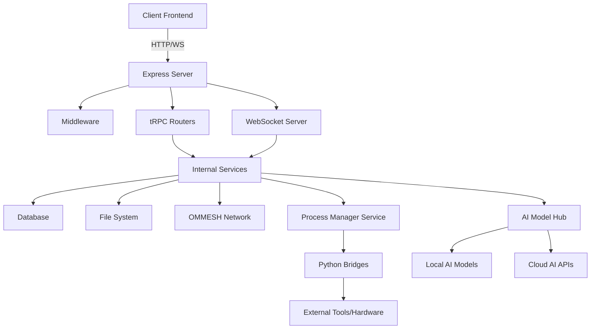

# Omnecor Backend Server Architecture

Omnecor's backend is a unified, Express.js-based server that acts as the central hub for all application logic, data management, and AI orchestration. This document details its architecture, key components, and operational flow.

## 1. Unified Server Design

The Omnecor backend consolidates various functionalities into a single Express server, eliminating the need for separate microservices for core operations. This design choice simplifies deployment, reduces infrastructure complexity, and ensures tight integration between components.

### System Architecture Diagram

## 2. Core Components

### 2.1. Express.js Application (`server/_core/index.ts`)

This is the main entry point for the Omnecor backend. It initializes the Express application, configures middleware, sets up API routes, and manages the lifecycle of various services.

-   **Initialization**: Bootstraps the server, including the tRPC API, WebSocket server, and static file serving.
-   **Port Discovery**: Automatically finds an available port if the default (3000) is in use.
-   **Health Check**: Provides a `/health` endpoint for monitoring server status.
-   **Graceful Shutdown**: Handles `SIGINT` and `SIGTERM` signals to ensure a clean shutdown, terminating child processes and closing WebSocket connections.

### 2.2. Middleware

Express middleware is used to process requests before they reach the route handlers. Key middleware includes:

-   **Rate Limiting**: Implemented using `express-rate-limit` to protect against abuse and ensure server stability.
-   **Body Parsers**: `express.json()` and `express.urlencoded()` are configured with increased limits (e.g., `50mb`) to support large file uploads.
-   **Security Middleware**: Includes measures for CSRF protection and path traversal prevention, handled by the `SecurityService`.

### 2.3. tRPC API (`server/routers/`)

Omnecor utilizes tRPC for its API layer, providing end-to-end type safety between the frontend and backend. All tRPC endpoints are accessible under the `/api/trpc/` path.

-   **`appRouter`**: The root tRPC router that aggregates all sub-routers.
-   **Sub-Routers**: Organized by domain (e.g., `aiRouter.ts`, `projectRouter.ts`, `securityRouter.ts`, `blenderRouter.ts`, `kicadRouter.ts`, `ommesh.router.ts`, `voiceRouter.ts`). These define the API endpoints for their respective domains.
-   **`createContext`**: A factory function that creates the tRPC context for each request, providing access to singleton services and other request-scoped data.

### 2.4. WebSocket Server (`server/phase2/websocket/WebSocketServer.ts`)

Integrated into the same HTTP server as the Express application, the WebSocket server (`/ws`) enables real-time, bi-directional communication.

-   **Real-time Updates**: Used for broadcasting updates related to Neural Node-Tree changes, AI training progress, hardware job statuses, and chat messages.
-   **Event-Driven**: Services can emit events that are then broadcast to connected clients, ensuring the UI remains synchronized with backend processes.

### 2.5. Internal Services (`server/phase2/services/`)

These are singleton classes that encapsulate specific business logic and resource management. They are initialized at server startup and made available through the tRPC context.

-   **`SecurityService`**: Manages cryptographic operations, user authentication, and authorization.
-   **`VectorDBService`**: Handles semantic indexing and retrieval for the knowledge base (ChromaDB).
-   **`ProcessManagerService`**: Orchestrates and monitors external child processes, particularly for Python bridges.
-   **`MeshDiscoveryService`**: Part of OMMESH, responsible for discovering and managing other Omnecor nodes.
-   **`AiProviderService`**: Manages connections and routing to various local and cloud AI models.
-   **`FileSystemWatcherService`**: Monitors specified directories for changes.
-   **`MemoryArchitectService`**: Manages AI context and memory layers (local ChromaDB-backed).
-   **`HonchoService`**: Manages cloud-backed cross-session user and session memory (Plastic Labs Honcho integration).
-   **`ValetRouterService`**: Routes tasks to appropriate providers based on task category and execution mode.
-   **`ValetServerService`**: Manages the Valet Router inference server lifecycle.
-   **`HITLApprovalService`**: Handles Human-In-The-Loop approval workflows.
-   **`HashTrackerService`**: Tracks content hashes for data integrity.

### 2.6. OMMESH Node (`server/ommesh/core/MeshNode.ts`)

The `MeshNode` is the core component of the OMMESH distributed mesh intelligence layer. It enables an Omnecor instance to participate in a network of other Omnecor nodes.

-   **Node Discovery**: Utilizes Bonjour for local network service discovery.
-   **Secure Communication**: Employs strict mTLS (Mutual TLS) over HTTPS on the advertised `MESH_PORT` (default 3001) for secure, authenticated communication. Rejects any MITM attempts via certificate pinning.
-   **Distributed Task Routing**: Facilitates the routing of AI inference requests and other tasks across the mesh based on resource availability, falling back gracefully to local compute.

### 2.7. Python Bridges (`server/python_bridges/`)

These are Python scripts that act as interfaces to specialized external tools and hardware. They are invoked and managed by the `ProcessManagerService`.

-   **`blender_bridge.py`**: Integrates with Blender for 3D tasks.
-   **`kicad_bridge.py`**: Integrates with KiCad for PCB design.
-   **`esptool_bridge.py`**: Interfaces with ESPTool for firmware flashing.
-   **`fal_bridge.py`**: Connects to Fal.ai services.
-   **`rvc_server.py`**: Handles Real-time Voice Cloning (RVC) services.

## 3. Data Persistence

-   **Database**: Omnecor uses Drizzle ORM for interacting with a MySQL/TiDB database. The database schema is defined in `drizzle/schema.ts` and managed through migrations.
-   **File System**: Local storage is extensively used for project files, AI model weights, configurations (`.env`), and log files. The `FileSystemWatcherService` monitors relevant directories.

## 4. Authentication and Authorization

-   **OAuth**: The backend includes routes for OAuth integration (`registerOAuthRoutes`), allowing for secure third-party authentication.
-   **Security Service**: The `SecurityService` is responsible for managing user sessions, permissions, and ensuring secure access to resources. It handles cryptographic operations and enforces security policies.

## 5. External API Resilience & Hardening

Omnecor integrates with 30+ external cloud services. All external API calls are protected by comprehensive resilience patterns and strict execution-mode barriers:

### Sovereign-Mode Central Guard (`server/_core/sovereign.ts`)

-   **Purpose**: Ensures air-gapped security by actively blocking any outbound requests to cloud AI providers when the user's execution mode is set to `sovereign`.
-   **Mechanism**: The `assertProviderAllowedInMode` central guard intercepts calls in protected procedures (like image generation or external curation) and raises a `FORBIDDEN` exception before any network request is formed.
-   **Scope**: Protects Anthropic, OpenAI, Fal.ai, OpenArt, and other remote endpoints from accidental API leakage.

### Resilient Fetch Wrapper (`server/_core/resilientFetch.ts`)

-   **Circuit Breaker**: Per-host failure tracking. Opens after 5 consecutive failures; closes after 60s cooldown.
-   **Exponential Backoff**: Transient errors (429, 5xx) trigger automatic retry with 1s → 2s → 4s delays.
-   **Timeout Protection**: AbortController enforces configurable timeout (default 30s).
-   **Retry-After Respect**: Honors rate-limit API responses for custom retry timing.

**Applied to**: Lithic (cards), all cloud compute providers (Vast.ai, RunPod, Lambda), OAuth token refresh, ElevenLabs TTS, and others.

### Sensitive Data Redaction (`server/_core/redaction.ts`)

All API errors and logs pass through `redactSensitive()` to prevent accidental exposure of:
- Payment card PANs and CVV
- Bearer tokens, JWTs, OAuth tokens, API keys
- PEM-encoded private keys and hex secrets

### Token Refresh Safety (`TokenRefreshService`)

-   **Pre-flight Expiry Check**: Verifies token validity (60s safety margin) before use.
-   **Automatic Refresh**: Expired tokens refreshed transparently via OAuth provider.
-   **Single 401-Retry Pattern**: If an API call fails with 401, token is refreshed once and call retried.
-   **Encrypted Storage**: Tokens encrypted at rest with AES-256-GCM.

### Transaction Atomicity for Financial Operations

Cloud compute instance start/stop and virtual card issuance operations are atomic:
- Sessions inserted as `status: "starting"` before cloud provider call
- Promoted to `running` only after provider confirms provisioning
- Spend logged only after provider confirms termination (2xx response)
- Per-user idempotency keys prevent duplicate charges on retry

**Guarantee**: Charges can never be orphaned. If provider confirms action, spending is logged atomically.

### Error Wrapping for Sensitive APIs

| API | Error Strategy |
|-----|---|
| **Lithic** | Raw errors logged internally; users see safe `CardOperationError` |
| **OAuth** | Failures don't expose cause; triggers re-auth flow |
| **Cloud Compute** | Users see clear env var names (e.g., "VASTAI_API_KEY not set") |

For detailed API reference, see [EXTERNAL_APIS.md](./EXTERNAL_APIS.md).
