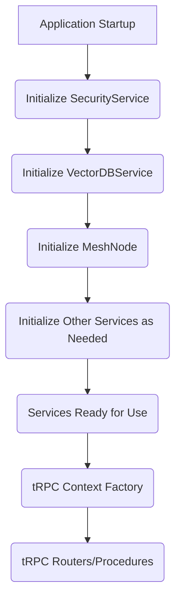
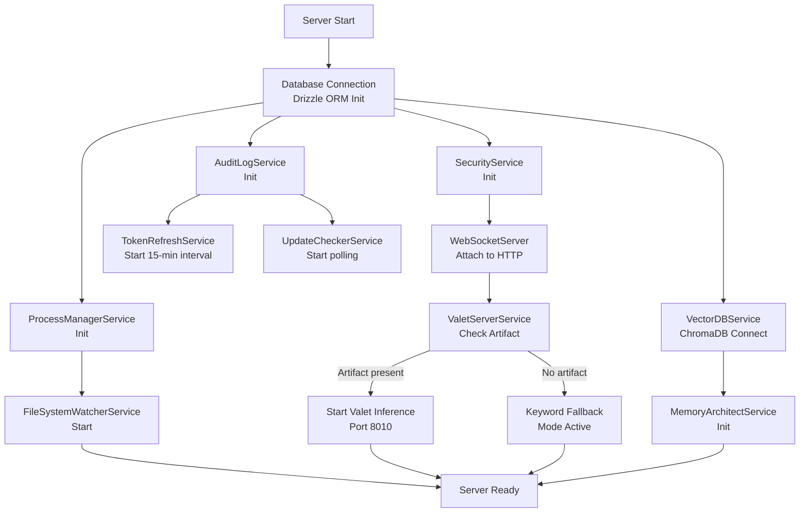

# Omnecor Backend Services Overview

Omnecor's backend functionality is modularized into a set of singleton services, each responsible for a specific domain or set of operations. These services are initialized at application startup and are made available to tRPC routers and other parts of the backend through a shared context. This design promotes separation of concerns, reusability, and testability.

## 1. Service Initialization and Lifecycle

Services are typically initialized in `server/_core/index.ts` during the application bootstrap phase. They are designed as singletons, meaning only one instance of each service exists throughout the application's lifetime. This ensures consistent state and resource management.

## 2. Core Services

### 2.1. `SecurityService` (`server/phase2/services/SecurityService.ts`)

-   **Purpose**: Manages all security-related aspects of the application, including authentication, authorization, and cryptographic operations.
-   **Key Responsibilities**:
    -   Handling user authentication flows (e.g., via OAuth).
    -   Managing user sessions and permissions.
    -   Enforcing access control policies.
    -   Performing data encryption (e.g., AES-256-GCM for sensitive local data).
    -   Protecting against common web vulnerabilities like CSRF and path traversal.

### 2.2. `VectorDBService` (`server/phase2/services/VectorDBService.ts`)

-   **Purpose**: Implements the knowledge base functionality, responsible for semantic indexing and retrieval of project data.
-   **Key Responsibilities**:
    -   Initializing and managing the ChromaDB instance.
    -   Processing documents and files through recursive chunking.
    -   Generating and storing vector embeddings of text chunks.
    -   Performing semantic search and retrieval for Retrieval-Augmented Generation (RAG).
    -   Graceful degradation if the vector database cannot be initialized.

### 2.3. `ProcessManagerService` (`server/phase2/services/ProcessManagerService.ts`)

-   **Purpose**: Orchestrates and monitors external child processes, primarily for integrating with Python-based hardware bridges and other external tools.
-   **Key Responsibilities**:
    -   Spawning and managing child processes (e.g., for Blender, KiCad, ESPTool bridges).
    -   Monitoring the health and status of external processes.
    -   Streaming output (e.g., logs, progress updates) from child processes back to the backend.
    -   Ensuring graceful shutdown of all managed processes during application termination.

### 2.4. `MeshDiscoveryService` (`server/ommesh/core/DiscoveryService.ts`)

-   **Purpose**: Part of the OMMESH distributed mesh intelligence layer, responsible for discovering and managing other Omnecor nodes on the local network.
-   **Key Responsibilities**:
    -   Utilizing Bonjour for zero-configuration service discovery.
    -   Maintaining a registry of active Omnecor nodes in the mesh.
    -   Facilitating secure communication setup between nodes.

### 2.5. `AiProviderService` (`server/phase2/services/AiProviderService.ts`)

-   **Purpose**: Manages connections to various local and cloud AI models and intelligently routes inference requests.
-   **Key Responsibilities**:
    -   Configuring and connecting to local AI inference servers (e.g., Ollama/Llama.cpp).
    -   Integrating with cloud AI APIs (e.g., OpenAI, Anthropic, Gemini, Fal.ai).
    -   Implementing logic for intelligent inference routing based on task, cost, and resource availability.
    -   Handling model loading and unloading.
    -   **Context Overflow Protection**: Explicitly calculates token estimations before prompting; throws `ContextOverflowError` to prevent out-of-memory (OOM) crashes, seamlessly downgrading or rejecting oversized payloads.

### 2.6. `FileSystemWatcherService` (`server/phase2/services/FileSystemWatcherService.ts`)

-   **Purpose**: Monitors specified directories for file system changes, triggering automated workflows like re-indexing or data processing.
-   **Key Responsibilities**:
    -   Setting up watch events on configured directories.
    -   Detecting file creation, modification, and deletion events.
    -   Notifying other services (e.g., `VectorDBService`) about relevant changes.

### 2.7. `MemoryArchitectService` (`server/phase2/services/MemoryArchitectService.ts`)

-   **Purpose**: Manages the AI context and memory layers, leveraging the `VectorDBService` to provide Retrieval-Augmented Generation (RAG) capabilities.
-   **Key Responsibilities**:
    -   Orchestrating the creation and retrieval of AI memory.
    -   Providing contextual information to AI models based on semantic search.
    -   Ensuring persistent storage and retrieval of AI context across sessions.

### 2.8. `HITLApprovalService` (`server/phase2/services/HITLApprovalService.ts`)

-   **Purpose**: Integrates Human-In-The-Loop (HITL) approval workflows into AI-driven tasks.
-   **Key Responsibilities**:
    -   Pausing AI workflows at critical junctures for human review.
    -   Managing approval requests and decisions via a live polling queue accessible through `security.getPendingHitlActions` and `security.resolveHitlAction`.
    -   Resuming workflows based on human input (Approve/Reject).

### 2.9. `HashTrackerService` (`server/phase2/services/HashTrackerService.ts`)

-   **Purpose**: Tracks content hashes for data integrity, change detection, and efficient caching.
-   **Key Responsibilities**:
    -   Calculating and storing hashes of files or data chunks.
    -   Detecting changes in content by comparing hashes.
    -   Optimizing operations by avoiding reprocessing unchanged data.

### 2.10. `HonchoService` (`server/phase2/services/HonchoService.ts`)

-   **Purpose**: Integrates Honcho (Plastic Labs) for cross-session, cloud-backed user and session memory. Complements the local ChromaDB/MemoryArchitectService with persistent external memory.
-   **Key Responsibilities**:
    -   Managing per-user facts and conversation history across sessions using Honcho's API.
    -   Storing metamessages labeled `omnecor_fact` for long-term user preferences and knowledge.
    -   Gracefully degrading when `HONCHO_API_KEY` is unset — all read/write methods become no-ops and the rest of the system continues unchanged.
    -   Maintaining a hierarchy: app → user → session → messages + metamessages.
-   **Configuration**: Controlled by `HONCHO_API_KEY` (enable/disable), `HONCHO_APP_NAME` (default `"omnecor"`), and `HONCHO_ENVIRONMENT` (`"demo"`, `"local"`, or `"production"`, default `"demo"`).

### 2.11. `ValetRouterService` (`server/phase2/services/ValetRouterService.ts`)

-   **Purpose**: TypeScript bridge to the Python Valet Router inference server (:8010). Routes tasks to appropriate providers/models based on task category, execution mode, and available resources.
-   **Key Responsibilities**:
    -   Sending routing requests to POST `/route` on the inference server.
    -   Falling back to rule-based keyword routing when the server is unavailable (logs a warning).
    -   Enforcing the HARDCODED_RULE: every task/project must create `todo.md` and `status.md`.
    -   Supporting 13 task categories and 10 routing modes; provider and model names are runtime-updatable via `routing_manifest.json`.

### 2.12. `ValetServerService` (`server/phase2/services/ValetServerService.ts`)

-   **Purpose**: Manages the lifecycle of the Valet Router inference server (`valet_router_inference.py` on :8010).
-   **Key Responsibilities**:
    -   Reading `models/valet-router/current.json` at boot and spawning the inference server when an artifact is registered.
    -   Performing health checks on `/health` and auto-restarting on crash (up to 5 times with exponential backoff).
    -   Wiring the server shutdown into the application's graceful shutdown process.
    -   Respecting `VALET_AUTO_START` environment variable (set to `"false"` to disable auto-start without removing the artifact).

### 2.13. `AuditLogService` (`server/phase2/services/AuditLogService.ts`)

-   **Purpose**: Maintains an append-only audit trail of all privileged system actions for compliance and security monitoring, with automatic time-based retention so the log never grows without bound.
-   **Key Responsibilities**:
    -   Recording login/logout events, HITL approvals, agent spawns, budget changes, and security events.
    -   Automatically scrubbing sensitive data (API keys, tokens, PII) via `redactSensitiveData()` before writing.
    -   Enforcing append-only semantics — entries are never updated; the only deletion path is the retention purge.
    -   Time-based retention: a background sweep (every 6 hours, started at server boot) deletes entries older than the configured window — 14 days by default, 28 days or permanent (0) selectable in Settings → Security. Permanent mode shows a storage-size warning in the UI.
    -   Providing filtered log viewing and CSV export capabilities for audit and compliance purposes.

### 2.14. `WebSocketServer` (`server/_core/websocket.ts`)

-   **Purpose**: Provides real-time pub/sub messaging across multiple channels for instant UI updates and cross-system communication.
-   **Key Responsibilities**:
    -   Publishing events to channels: `training`, `hardware`, `voice`, `mesh`, `budget`, `security`.
    -   Handling client subscriptions and delivering filtered messages based on channel subscriptions.
    -   Enabling real-time streaming of progress updates from long-running operations (e.g., model training, file processing).

### 2.15. `TokenRefreshService` (`server/phase2/services/TokenRefreshService.ts`)

-   **Purpose**: Automatically refreshes OAuth tokens on a recurring interval to maintain valid authentication without user intervention.
-   **Key Responsibilities**:
    -   Implementing 15-minute token refresh cycles for cloud AI providers and external integrations.
    -   Handling token rotation and storage of refreshed credentials (AES-256-GCM encrypted at rest).
    -   Gracefully handling refresh failures and notifying the user if re-authentication is required.
    -   Pre-flight expiry checks (60s skew) before making authenticated API calls.
    -   Safe retry logic with single 401-refresh-retry pattern for automatic token recovery.

### 2.15a. `resilientFetch` Utility (`server/_core/resilientFetch.ts`)

-   **Purpose**: Provides a robust fetch wrapper for all external API calls with timeout, retry, and circuit-breaker capabilities.
-   **Key Responsibilities**:
    -   Implementing exponential backoff on transient failures (429 rate limits, 5xx errors; respects `Retry-After` header).
    -   Per-host circuit breaker: opens after 5 consecutive failures, enters half-open state after 60s cooldown.
    -   AbortController timeout enforcement (default 30s, configurable per call).
    -   Throwing `CircuitOpenError` when a breaker is open to fail fast and prevent cascading failures.
    -   Applied to critical external APIs: Lithic (cards), cloud compute (Vast.ai/RunPod/Lambda), OAuth refresh, ElevenLabs, and others.

### 2.15b. `apiClient` Wrapper (`server/_core/apiClient.ts`)

-   **Purpose**: Unified API client for consistent error handling, logging, and redaction across all external services.
-   **Key Responsibilities**:
    -   Wrapping fetch calls with timeout protection and labeled error context (`[Service.method]`).
    -   Delegating to `resilientFetch` for retry and circuit-breaker logic.
    -   Automatically redacting sensitive request/response data before logging (via `redactSensitive()`).
    -   Applied to: ComfyUI, PCBWay, OpenArt, ElevenLabs, and other service clients.

### 2.15c. `redactSensitive` Utility (`server/_core/redaction.ts`)

-   **Purpose**: Centralized sensitive data redaction to prevent accidental exposure of secrets in logs, errors, and audit trails.
-   **Key Responsibilities**:
    -   Detecting and redacting payment card PANs (Luhn-validated to prevent false positives).
    -   Removing CVV, CVC, and other payment card fields.
    -   Redacting Bearer tokens, JWTs, and OAuth access/refresh tokens.
    -   Removing PEM-encoded private keys and hex-encoded secrets.
    -   Sanitizing long opaque authentication tokens and `.env` file contents.
    -   Applied to: Lithic card operations, API error messages, audit logs, and service logs.

### 2.15d. `PublishingService` (`server/phase2/services/PublishingService.ts`)

-   **Purpose**: Executes outbound social media publishing requests to connected external platforms.
-   **Key Responsibilities**:
    -   Dispatches scheduled or direct posts to APIs like Twitter, LinkedIn, etc.
    -   Handles API communication using decrypted OAuth tokens from the secure integrations store.
    -   Catches external HTTP errors (e.g., 403 Forbidden) and writes honest status failure messages back to the database.

### 2.15e. `BirdClawService` (`server/phase2/services/BirdClawService.ts`)

-   **Purpose**: A Playwright-based scraper specialized in fetching and rendering JavaScript-heavy web pages and social media platforms.
-   **Key Responsibilities**:
    -   Utilizes stealth plugins to bypass basic bot-mitigation techniques naturally.
    -   Integrates with `ArticleDiscoveryService` to pull deep content where standard fetch requests fail or get blocked.

### 2.15f. `PenpotService` (`server/phase2/services/PenpotService.ts`)

-   **Purpose**: A headless bridge integrating the open-source Penpot design tool into Omnecor's frontend generation.
-   **Key Responsibilities**:
    -   Fetches and parses raw design tokens (colors, typography, spacing) directly from Penpot.
    -   Assists AI UI builder agents in generating React components that perfectly match the design source-of-truth.

### 2.16. `UpdateCheckerService` (`server/phase2/services/UpdateCheckerService.ts`)

-   **Purpose**: Periodically checks for new Omnecor releases on GitHub and notifies the user of available updates.
-   **Key Responsibilities**:
    -   Polling GitHub release API on a configurable interval.
    -   Detecting version upgrades and comparing against current installation.
    -   Emitting update notifications via WebSocket events to the UI.

### 2.17. `BlenderBridge` (`server/phase2/bridges/BlenderBridge.ts` + `server/python_bridges/blender_bridge.py`)

-   **Purpose**: Orchestrates 3D modeling and rendering automation tasks through Blender.
-   **Key Responsibilities**:
    -   Spawning and managing Blender processes via `ProcessManagerService`.
    -   Executing Python scripts for asset generation, scene rendering, and model manipulation.
    -   Streaming progress and output back to the UI.

### 2.18. `KiCadBridge` (`server/phase2/bridges/KiCadBridge.ts` + `server/python_bridges/kicad_bridge.py`)

-   **Purpose**: Automates PCB design tasks including schematic validation, layout, and electrical rules checking (ERC/DRC).
-   **Key Responsibilities**:
    -   Interfacing with KiCad via Python API for headless automation.
    -   Running design rule checks (DRC) and electrical rules checks (ERC).
    -   Managing schematic-to-layout workflows and generating fabrication outputs (Gerbers, drill files).

### 2.19. `ESPToolBridge` (`server/phase2/bridges/ESPToolBridge.ts` + `server/python_bridges/esptool_bridge.py`)

-   **Purpose**: Automates ESP32/ESP8266 firmware flashing, serial monitoring, and hardware communication.
-   **Key Responsibilities**:
    -   Detecting connected serial devices and managing firmware upload workflows.
    -   Monitoring serial output from microcontroller devices in real time.
    -   Managing flash partition layout, erasing, and verifying firmware integrity.

### 2.20. `MemoryArchitectService` (Extended) (`server/phase2/services/MemoryArchitectService.ts`)

-   **Purpose**: Manages the complete memory and context layers, including both local ChromaDB and cloud-backed Honcho integration.
-   **Key Responsibilities**:
    -   Orchestrating document chunking strategies (recursive, semantic, fixed-size).
    -   Retrieving semantically relevant context from ChromaDB via vector similarity search.
    -   Integrating with `HonchoService` for cross-session persistent user facts and preferences.
    -   Providing a unified RAG interface that transparently combines local and persistent memory.

### 2.21. `VoiceService` (`server/phase2/services/VoiceService.ts` + FastAPI bridge)

-   **Purpose**: Manages speech-to-text (STT), text-to-speech (TTS), and real-time voice cloning (RVC).
-   **Key Responsibilities**:
    -   Sending audio to Whisper endpoints for transcription.
    -   Converting text to speech via XTTS-v2 or ElevenLabs cloud voices.
    -   Proxying voice cloning requests to RVC models.
    -   Managing FastAPI microservice lifecycle and health checks.

---

## 3. Service Startup Sequence

---

## 4. Service Interaction

Services primarily interact with each other by calling methods on their singleton instances. This allows for a clean, dependency-injected architecture where services can collaborate to fulfill complex requests. The tRPC context factory (`server/_core/context.ts`) plays a crucial role in making these service instances available to every tRPC procedure.
