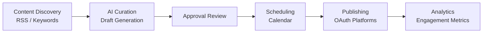
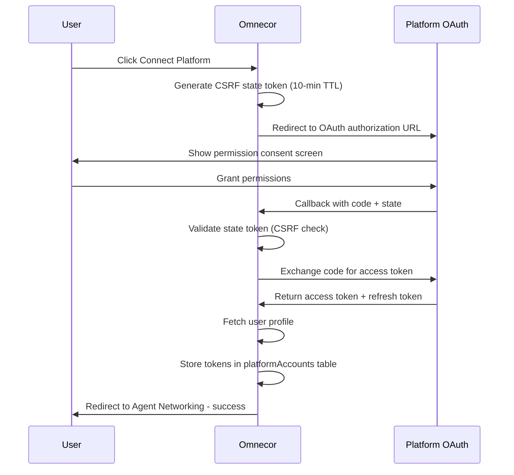
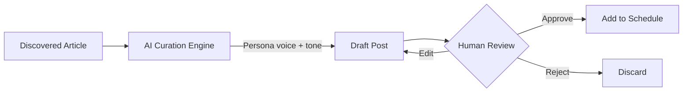

# Agent Networking — Social Media Automation Guide

Agent Networking is Omnecor's built-in social media automation system. It enables AI-driven content scheduling, discovery, curation, and publishing across multiple platforms from a single unified interface.

**Access:** Click the "Agent Networking" icon in the sidebar navigation.

---

## 1. Overview

Agent Networking provides a complete social media workflow:



**Supported Platforms:**
| Platform | OAuth Scope | Post Types |
|---|---|---|
| Twitter / X | Tweet read/write, DMs | Text, images, threads |
| LinkedIn | Posts, profile | Articles, images |
| Instagram | Content, media | Images, carousels |
| TikTok | Video, profile | Video content |
| Facebook | Pages, posts | Text, images, links |
| YouTube | Upload, channel | Videos, community posts |

> **Publishing vs. connecting (updated 2026-06).** The table above governs account
> **connection, discovery, and analytics** via Omnecor's OAuth flow. The **publish**
> transport is now hybrid and does not map 1:1 to it:
> - **Native publish** (direct from Omnecor, no developer app): **Bluesky, Mastodon,
>   Discord, Telegram**.
> - **Webhook → n8n publish**: **X (Twitter), LinkedIn, Facebook, Instagram** —
>   authenticated once inside a locally-run n8n instance.
> - **TikTok** has no publish path, and **YouTube** is intentionally unsupported (no
>   text/community-post API — scheduling one returns a clear "not supported" error).
>
> See **[Social publishing — hybrid (native + n8n)](../social-publishing-n8n.md)** for
> the full setup, the webhook contract, and Sovereign-mode behavior.

---

## 2. First-Time Setup

### 2.1. Prerequisites

Before connecting platforms, configure OAuth credentials in `.env`:

```bash
# Twitter/X
TWITTER_CLIENT_ID=your_twitter_client_id
TWITTER_CLIENT_SECRET=your_twitter_client_secret

# LinkedIn
LINKEDIN_CLIENT_ID=your_linkedin_client_id
LINKEDIN_CLIENT_SECRET=your_linkedin_client_secret

# Instagram
INSTAGRAM_CLIENT_ID=your_instagram_client_id
INSTAGRAM_CLIENT_SECRET=your_instagram_client_secret

# TikTok
TIKTOK_CLIENT_ID=your_tiktok_client_id
TIKTOK_CLIENT_SECRET=your_tiktok_client_secret

# Facebook
FACEBOOK_CLIENT_ID=your_facebook_client_id
FACEBOOK_CLIENT_SECRET=your_facebook_client_secret

# YouTube
YOUTUBE_CLIENT_ID=your_youtube_client_id
YOUTUBE_CLIENT_SECRET=your_youtube_client_secret
```

For step-by-step OAuth app creation on each platform, see [OAUTH_SETUP.md](../OAUTH_SETUP.md).

### 2.2. Connecting a Platform

1. Navigate to **Agent Networking → Platforms** tab.
2. Click the platform button (e.g., "Connect X (Twitter)").
3. Your browser opens the platform's authorization page.
4. Grant the requested permissions.
5. The platform redirects back to Omnecor.
6. The connected account appears in the **Connected Accounts** list.

**OAuth Flow Diagram:**



### 2.3. Disconnecting a Platform

1. Go to **Agent Networking → Platforms** tab.
2. Find the connected account in the **Connected Accounts** list.
3. Click **Disconnect**.
4. The account is deactivated (tokens invalidated; record kept for audit).

---

## 3. Creating Personas

Personas are the social media identities that post your content. Each persona has its own tone, style, and platform configuration.

**Access:** Agent Networking → Personas tab

### 3.1. Persona Types

| Type | Description |
|---|---|
| **Brand Identity** | A company or product voice — consistent tone, professional |
| **Personal / Creator** | An individual's voice — authentic, casual, niche-specific |
| **Omnecor Agent** | A fully autonomous posting agent with its own schedule |

### 3.2. Creating a Persona

1. Click **+ New Persona** in the Personas tab.
2. Fill in:
   - **Name** — Display name for the persona
   - **Bio** — Short description / social media bio
   - **Personality** — Free-text description of character traits
   - **Tone** — Select from: Professional, Casual, Humorous, Educational, Inspirational
   - **Hashtags** — Default hashtag pool for this persona
   - **Platform Bios** — Per-platform bio variations (optional)
   - **Posting Schedule** — Days and times for automated posts
3. Click **Save Persona**.

### 3.3. Assigning a Persona to a Platform

- Under the persona settings, select which **Connected Platform Accounts** this persona posts to.
- A single persona can post to multiple platforms simultaneously.

---

## 4. Content Discovery

The Content Discovery engine finds relevant articles and topics for your personas to react to or share.

**Access:** Agent Networking → Discovery tab

### 4.1. Configuring Sources

| Source Type | Description |
|---|---|
| **RSS Feeds** | Add any RSS/Atom feed URL |
| **Keywords** | Monitor for trending content matching keywords |
| **Competitor Tracking** | Watch specified account activity |

### 4.2. Discovery Settings

- **Refresh Interval** — How often to poll sources (minimum 15 minutes)
- **Relevance Threshold** — Minimum relevance score (0–100) to surface articles
- **Max Articles Per Run** — Cap on articles fetched per refresh cycle

> **Note:** RSS/API feed ingestion is currently being finalized. Keyword-based discovery is fully operational.

---

## 5. Content Curation & Drafting

The AI curation engine turns discovered articles into draft posts tailored to each persona's voice.

**Access:** Agent Networking → Approvals tab

### 5.1. Workflow



### 5.2. Reviewing Drafts

1. In the **Approvals** tab, review pending drafts.
2. Each draft shows: original article, persona, target platform, and AI-generated content.
3. Options:
   - **Approve** — Add to publishing schedule
   - **Edit** — Modify the draft before approving
   - **Reject** — Discard the draft

---

## 6. Scheduling & Publishing

**Access:** Agent Networking → Calendar tab

### 6.1. Calendar View

The calendar shows all scheduled posts across all platforms and personas. You can:
- Drag posts to reschedule them
- Click a post to edit or delete it
- Filter by platform or persona

### 6.2. Scheduling a Post Manually

1. Click **+ New Post** or an empty calendar slot.
2. Select: persona, platform, post content, and publish time.
3. Click **Schedule**.

### 6.3. Publishing Status

| Status | Description |
|---|---|
| `scheduled` | Queued for future publishing |
| `publishing` | Currently being sent to platform |
| `published` | Successfully posted |
| `failed` | Publishing error — check platform connection |
| `cancelled` | Manually cancelled before publishing |

---

## 7. Analytics

**Access:** Agent Networking → Analytics tab

Track engagement performance across all connected platforms.

| Metric | Description |
|---|---|
| **Reach** | Unique accounts that saw your post |
| **Impressions** | Total times your post was displayed |
| **Engagement** | Likes + comments + shares / impressions |
| **Link Clicks** | Click-throughs on any links in the post |

> Analytics are refreshed automatically when the platform OAuth token is active.

---

## 8. Security Notes

- **CSRF Protection**: Every OAuth flow generates a unique state token with a 10-minute TTL. Callbacks with invalid or expired state tokens are rejected.
- **Token Storage**: OAuth tokens are stored in the database. Access tokens are refreshed automatically by `TokenRefreshService` on a 15-minute interval.
- **Token Scope**: Omnecor only requests the minimum scopes needed for publishing. No access to DMs, followers, or private data beyond the account profile.
- **Disconnect Anytime**: Disconnecting a platform immediately deactivates the token. No further API calls are made for that account.

---

## 9. Troubleshooting

| Problem | Solution |
|---|---|
| OAuth callback fails with "state mismatch" | Your session expired (>10 min). Restart the OAuth flow. |
| Platform shows "Disconnected" after refresh | Token expired. Reconnect via the Platforms tab. |
| Posts fail to publish | Check the platform API status page and verify permissions. |
| Analytics not updating | Ensure the platform account is still connected and the token is valid. |
| No articles in Discovery | Check RSS feed URLs are valid; keyword sources may need 15+ min to populate. |

---

## 10. Related Documentation

- [OAUTH_SETUP.md](../OAUTH_SETUP.md) — Step-by-step OAuth app creation for each platform
- [PERSONA_AGENT_GUIDE.md](PERSONA_AGENT_GUIDE.md) — Using personas as autonomous agents
- [AGENTIC_WALLET.md](../wallet/AGENTIC_WALLET.md) — Cost tracking for API calls
