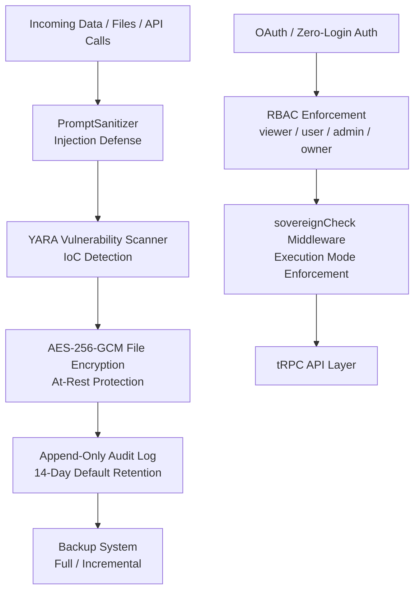
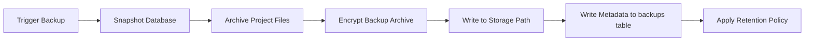

# Omnecor Security Features Guide

Omnecor includes a layered security architecture protecting data at rest, in transit, and during processing. This guide covers the five main security systems.

---

## 1. Security Architecture Overview



---

## 2. File Encryption (AES-256-GCM)

Omnecor provides per-file encryption for sensitive project files stored on disk.

**Implementation:** `server/_core/security.ts` + `server/routers/securityRouter.ts`

### How It Works

- **Algorithm:** AES-256-GCM — authenticated encryption providing both confidentiality and integrity verification.
- **Key Derivation:** Each file gets a unique derived key. Key material is never stored alongside the encrypted content.
- **IV (Initialization Vector):** A random IV is generated per encryption operation and stored as metadata.
- **Authentication Tag:** The GCM tag verifies the ciphertext has not been tampered with on decryption.

### Using File Encryption

| tRPC Procedure | Description |
|---|---|
| `security.encryptFile` | Encrypt a file and store encryption metadata |
| `security.decryptFile` | Decrypt a previously encrypted file |
| `security.getEncryptionStatus` | Check whether a file is currently encrypted |

**UI Access:** Settings → Security → File Encryption

### Encryption Metadata

Encryption metadata is stored in the `encryptedFiles` database table:
- File path reference
- Key identifier
- Algorithm used
- IV (hex-encoded)
- GCM authentication tag
- Encryption timestamp

---

## 3. System Backup & Recovery

Omnecor can create full and incremental backups of your entire workspace.

**Implementation:** `server/routers/securityRouter.ts`

### Backup Types

| Type | Contents | Use Case |
|---|---|---|
| **Full** | Database + all project files + configuration (`.env` values encrypted) | Initial backup; after major changes |
| **Incremental** | Only changed files since last backup | Regular scheduled backups |

### Creating a Backup

| tRPC Procedure | Description |
|---|---|
| `security.createBackup` | Initiate a full or incremental backup |
| `security.listBackups` | List all available backups with metadata |
| `security.restoreBackup` | Restore from a specific backup with rollback option |
| `security.deleteBackup` | Remove a backup from the retention pool |

**UI Access:** Settings → Security → Backup & Recovery

### Backup Workflow



### Retention Policy

- Configure maximum number of backups to retain.
- Oldest backups are automatically deleted when the retention limit is reached.
- Minimum 1 backup is always preserved regardless of policy.

### Restore Process

1. Navigate to Settings → Security → Backup & Recovery.
2. Select a backup from the list.
3. Click **Restore** — a pre-restore snapshot is automatically taken.
4. If the restore fails or is unsatisfactory, click **Rollback** to return to the pre-restore state.

---

## 4. Vulnerability Scanning & IoC Detection

Omnecor scans uploaded and processed files against threat intelligence feeds before they enter the workflow.

**Implementation:** `server/routers/securityRouter.ts` + YARA engine

### How It Works

- **YARA Rules:** Industry-standard pattern matching rules for detecting malware signatures and behavioral indicators.
- **IoC Feeds:** Indicators of Compromise from threat intelligence sources are regularly updated.
- **Pre-Processing Scan:** Files are scanned automatically before any processing, generation, or storage.
- **Real-Time Alerts:** Threat detections emit `security:threat_detected` WebSocket events to the UI.

### Threat Levels

| Level | Description | Action |
|---|---|---|
| `clean` | No threats detected | File proceeds normally |
| `suspicious` | Low-confidence indicators | Warning displayed; user can override |
| `malicious` | High-confidence threat | File blocked; audit log entry created |
| `critical` | Critical threat / known malware | File quarantined; admin notified |

### Managing Threat Scans

| tRPC Procedure | Description |
|---|---|
| `security.scanFile` | Manually scan a specific file |
| `security.updateThreatFeeds` | Refresh IoC/YARA rule database |
| `security.getThreatReport` | Get scan history and threat summary |

**UI Access:** Settings → Security → Threat Dashboard

---

## 5. Append-Only Audit Log

Every privileged system action is written to an append-only audit log. Entries can never be edited or rewritten by application code — the only deletion path is the time-based retention purge described below.

**Implementation:** `AuditLogService` + `audit_log` database table

### Retention & Storage

Without a retention window an append-only log grows without bound (every tRPC call is logged), so entries are purged automatically once they age out:

| Option | Behavior |
|---|---|
| **2 weeks (default)** | Entries older than 14 days are deleted by a background sweep that runs every 6 hours. |
| **4 weeks** | Same sweep, 28-day window. |
| **Permanent** | Nothing is ever deleted. The Settings panel shows a storage warning with the current entry count and approximate table size — busy workstations can add tens of thousands of entries per week, so export and prune periodically if disk space matters. |

Change it under **Settings → Security → Audit Log Retention** (Admin/Owner role required). Shrinking the window applies immediately, and the retention change itself is recorded in the audit log (`audit_retention_changed`).

> The audit log persists in both MySQL and SQLite (Sovereign) mode with the identical retention/purge schedule — the `audit_log` table exists in both backends and the 6-hour sweep runs regardless of mode.

### What Gets Logged

- User login / logout events
- HITL approvals and rejections
- Agent spawns and terminations
- Budget changes and virtual card issuance
- Hardware bridge invocations (Blender, KiCad, ESPTool)
- Security events (injection attempts, threat detections)
- Execution mode changes

### Viewing the Audit Log

1. Navigate to **Settings → Admin → Audit Log** (Admin/Owner role required).
2. Filter by event type, actor, date range, or procedure.
3. Export to CSV: `audit.exportAuditLog` procedure (Admin only).

### PII Redaction

All audit log entries pass through `redactSensitiveData()` before writing:
- API keys are replaced with `[REDACTED]`
- Tokens are replaced with `[REDACTED]`
- Email addresses and personal data are scrubbed per GDPR-aligned rules

---

## 6. Prompt Injection Defense

The `PromptSanitizer` inspects all user inputs and agent outputs for prompt injection patterns.

**What it blocks:**
- Direct injection attempts (`"Ignore all previous instructions..."`)
- Role-confusion attacks (`"You are now a different AI..."`)
- Instruction override patterns

**On detection:**
- The input is blocked.
- A `security:injection_attempt` WebSocket event is fired.
- An audit log entry is created with the redacted input.
- The user receives an error message without details that could help refine the attack.

---

## 7. Execution Mode Enforcement

The `sovereignCheck` middleware enforces your chosen Execution Mode at the tRPC API layer.

| Mode | Cloud APIs | Behavior |
|---|---|---|
| **Sovereign** 🔴 | Blocked server-side | `sovereignCheck` throws `FORBIDDEN` before any cloud call is made |
| **Scrapper** ⚡ | Fallback only | Cloud used only when no local model satisfies the request |
| **Big Spender** 🔥 | Preferred | Cloud models selected by default for quality |

**Zero-Login / Air-Gapped Mode:** Set `ZERO_LOGIN_MODE=true` to bypass all OAuth and run every request as a local admin. The session defaults to Sovereign Mode (`ZERO_LOGIN_EXECUTION_MODE=sovereign`, cloud blocked); set it to `scrapper`/`big_spender` to allow spend-tracked cloud calls for local testing. No external calls are made during boot.

---

## 8. External API Security Hardening

Omnecor integrates with 30+ external cloud services (AI providers, payment processors, cloud compute, etc.). All external API calls are hardened with comprehensive security and reliability protections.

**Implementation:** `server/_core/resilientFetch.ts`, `server/_core/apiClient.ts`, `server/_core/redaction.ts`

### Core Protections

#### Rate Limiting & Circuit Breaker
- **Exponential Backoff:** Transient failures (rate limits, 5xx errors) trigger automatic retry with 1s → 2s → 4s delays
- **Respects `Retry-After` Header:** Rate-limit responses with custom retry timing are honored
- **Per-Host Circuit Breaker:** After 5 consecutive API failures, the circuit opens for 60 seconds (fail-fast to prevent cascading)
- **Half-Open Recovery:** After cooldown, circuits attempt recovery with a test request

**Protected APIs:**
- Cloud Compute: Vast.ai, RunPod, Lambda Labs (instance start/stop)
- Payments: Lithic virtual card issuance
- Speech: ElevenLabs TTS synthesis
- OAuth: Google & Microsoft token refresh

#### Sensitive Data Redaction
All error messages, logs, and audit entries are automatically scrubbed of secrets:
- **Payment Cards:** PAN (Luhn-validated), CVV, expiration
- **Tokens:** Bearer tokens, JWT, OAuth access/refresh tokens, API keys
- **Cryptographic Material:** PEM-encoded private keys, hex-encoded secrets
- **Environment Data:** Redacted from logged error responses

This prevents accidental exposure of card numbers, API keys, or authentication tokens in error logs.

#### Error Wrapping for Sensitive APIs
Certain APIs that handle financial or authentication data have special error wrapping:

| API | Error Handling |
|---|---|
| **Lithic Cards** | Raw errors logged internally only; users see safe `CardOperationError` |
| **OAuth Refresh** | Token refresh failures don't expose why (transient vs. revoked); triggers re-auth flow |
| **Cloud Compute** | Start/stop failures show clear env var name (e.g. "VASTAI_API_KEY not set") |

#### Token Refresh Safety
OAuth tokens are automatically refreshed with safety guarantees:
- **Pre-flight Expiry Check:** Before using any token, `isTokenExpired()` checks if refresh is needed (60s safety margin)
- **Automatic Refresh:** If expired, the token is refreshed transparently
- **Single Retry Pattern:** If an API call fails with 401 (unauthorized), the token is refreshed once and the call is retried
- **Token Encryption:** Stored tokens are encrypted with AES-256-GCM; plaintext tokens are never persisted

#### Cloud Compute Transaction Safety
Virtual card issuance and cloud compute instance lifecycle operations are atomic:
- **Optimistic Locking:** Sessions inserted as `status: "starting"` before cloud provider call
- **Confirmed Only:** Only promoted to `running` after provider confirms provisioning succeeded
- **Idempotency Keys:** Per-user request deduplication prevents duplicate charges on retry
- **Spend Log Atomicity:** Billing is recorded only after cloud provider confirms termination (2xx response)

**Guarantee:** Charges can never be orphaned. If a cloud provider confirms an action, spending is logged. If it fails, the session stays pending and an error is returned.

#### CORS & Cross-Origin Validation
- **Origin Header Validation:** Foreign origins are blocked from state-changing `/api/trpc` endpoints (403 Forbidden)
- **Defense in Depth:** CSRF protection layers on top of SameSite=Strict cookies
- **Header Isolation:** External API calls only send caller-supplied headers; no internal tokens leak to 3rd parties

### Configuration

All external API credentials are configured via environment variables (see `.env.example`):

```bash
# AI Providers
ANTHROPIC_API_KEY=...
OPENAI_API_KEY=...
GOOGLE_GEMINI_API_KEY=...

# Voice & Speech
ELEVENLABS_API_KEY=...

# Payment & Finance
LITHIC_API_KEY=...
PCBWAY_API_KEY=...

# Cloud Compute
VASTAI_API_KEY=...
RUNPOD_API_KEY=...
LAMBDA_API_KEY=...

# OAuth
GOOGLE_CLIENT_ID=...
GOOGLE_CLIENT_SECRET=...
MICROSOFT_CLIENT_ID=...
MICROSOFT_CLIENT_SECRET=...
```

**Optional vs. Required:**
- **Optional APIs:** Missing keys disable features gracefully (e.g., no OpenAI = local Ollama fallback)
- **Startup Diagnostics:** Missing optional API keys are logged as info; users see which providers are disabled
- **No Silent Failures:** When an API key is needed but missing, users get clear error messages naming the env var

### Monitoring & Debugging

**Check API Health:**
```bash
# View startup diagnostics
curl http://localhost:3000/health

# See which services are available
# Check server logs for "[Optional: X_API_KEY not set]" messages
```

**Circuit Breaker State:**
When a circuit opens, logs show:
```
[WARN] resilientFetch | Circuit breaker OPEN for lithic (5 consecutive failures)
[WARN] resilientFetch | Circuit breaker HALF-OPEN for lithic after 60s cooldown
```

**Related Documentation:**
- [EXTERNAL_ENDPOINTS_AUDIT.md](../../EXTERNAL_ENDPOINTS_AUDIT.md) — Complete catalog of all 30+ external APIs
- [AGENTIC_WALLET.md](../wallet/AGENTIC_WALLET.md) — Virtual card & payment safety

---

## 9. Role-Based Access Control

| Role | Permissions |
|---|---|
| `viewer` | Read-only access to dashboards and outputs |
| `user` | Full workstation access; no admin functions |
| `admin` | User management; audit log access; threat dashboard |
| `owner` | Full access including destructive operations and export |

---

## 10. Related Documentation

- [SECURITY.md](../../SECURITY.md) — Security policy, vulnerability reporting
- [EXECUTION_MODES.md](../sovereignty/EXECUTION_MODES.md) — Detailed execution mode reference
- [AGENTIC_WALLET.md](../wallet/AGENTIC_WALLET.md) — Financial isolation with virtual cards
- [DATABASE_SCHEMA.md](../backend/DATABASE_SCHEMA.md) — Schema for audit_log, encryptedFiles, backups
